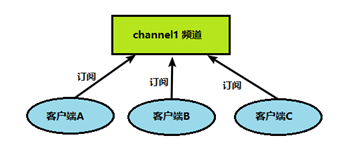
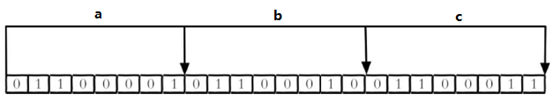
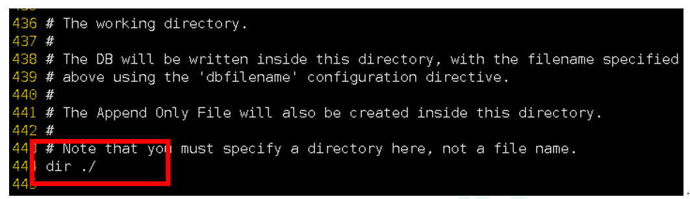
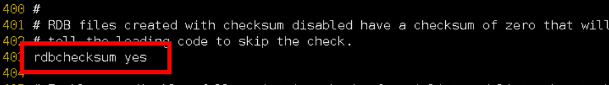
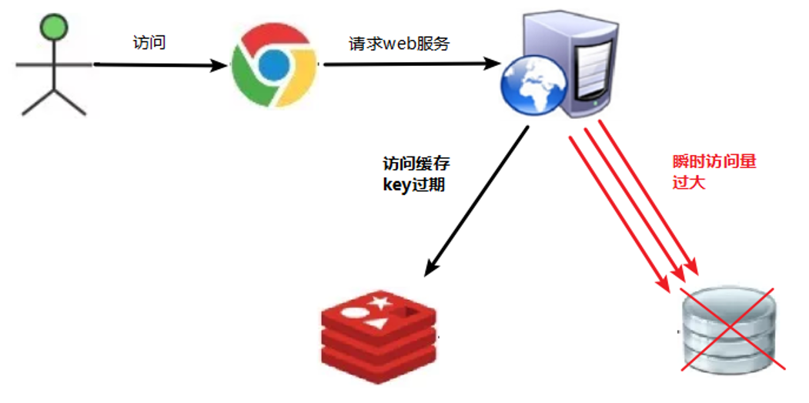
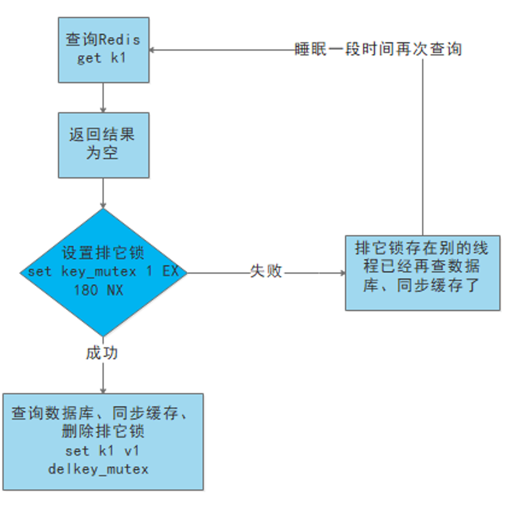

Redis6

# 一、NoSQL数据库简介

### 01、技术发展

技术的分类

1. 解决功能性的问题：Java、Jsp、RDBMS、Tomcat、HTML、Linux、JDBC、SVN
2. 解决扩展性的问题：Struts、Spring、SpringMVC、Hibernate、Mybatis
3. 解决性能的问题：NoSQL、Java线程、Hadoop、Nginx、MQ、ElasticSearch

#### 01-1、Web 1.0时代


#### 01-2、Web 2.0时代


#### 01-3、解决CPU及内存压力


#### 01-4、解决IO压力


### 02、NoSQL数据库

#### 02-1、NoSQL数据库概述

NoSQL(NoSQL=**Not Only SQL**),意即“不仅仅是SQL”泛指**非关系型数据库**。

NoSQL不依赖业务逻辑存储，而以简单的key-value模式存储。因此大大的增加了数据库的扩展能力

- 不遵循SQL标准
- 不支持ACID。（原子性）
- 远超于SQL的性能

#### 02-2、NoSQL适用场景

- 对数据高并发的读写
- 海量数据的读写
- 对数据高可扩展性

#### 02-3、NoSQL不适用场景

- 需要事务支持
- 基于sql的结构化查询存储，处理复杂的关系，需要**即席**查询
- **用不着sql和用了sql也不行的情况，可以考虑用NoSQL**

#### 02-4、Memcache

- 很早出现的NoSQL数据库
- 数据都在内存中，一般**不持久化**
- 支持简单的key-value模式，**支持类型单一**
- 一般是作为**缓存数据库**辅助持久化的数据库

#### 02-5、Redis

- 几乎覆盖了Memcache的绝大部分功能
- 数据都在内存中，**支持持久化**，主要用作备份恢复
- 除了支持简单的key-value模式，还**支持多种数据结构的存储，比如list、set、hash、zset等**
- 一般是作为**缓存数据库**辅助持久化的数据库

#### 02-6、MongoDB

- 高性能、开源、模式自由(schema free)的**文档型数据库**
- 数据都在内存中，如果内存不足，把不常用的数据保存到硬盘
- 虽然是key-value模式，但是对value（尤其是json）提供了丰富的查询功能
- 支持二进制数据及大型对象
- 可以根据数据的特点**替代RDBMS**， 成为独立的数据库。或者配合RDBMS，存储特定的数据

### 03、行式存储数据库（大数据时代）

#### 03-1、行式数据库

数据按行存储，查询用户的信息能力快，查询所有人的平均年龄慢


#### 03-2、列式数据库

数据按列存储，查询用户信息能力慢，查询所有人的平均年龄快


### 04、DB-Engines数据库排名


# 二、Redis6概述和安装

- Redis是一个**开源的key-value**存储系统
- 和Memcached类似，它支持存储的value类型相对很多，包括**string**(字符串)、**list**(链表)、**set**(集合)、**zset**(有序集合)和**hash**(哈希类型)
- 这些数据类型都支持push/pop、add/remove及取交集和差集及更丰富的操作，这些**操作都是原子性**
- 在此基础上，Redis支持各种不同方式的**排序**
- 与memcached一样，为了保证效率，数据都是缓存在内存中
- 区别的是Redis会周期性的把更新的数据写入磁盘或者把修改操作写入追加的记录文件
- 再次基础上实现了master-slave（主从）同步

## 01、应用场景

### 01-1、配合关系型数据库做高速缓存

- 高频次，热门访问的数据，降低数据库的IO
- 分布式架构，做session共享


### 01-2、多样的数据结构存储持久化


## 02、Redis安装

| Redis官方网站   | Redis中文网站    |
| --------------- | ---------------- |
| http://redis.io | http://redis.cn/ |


### 02-1、安装版本

- 6.2.4 for Linux （redis.6.2.4.tar.gz)
- 不用考虑windows环境下对Redis的支持

### 02-2、安装步骤

1. 下载最新版的gcc编译器

   ```shell
   yum install gcc
   # 测试gcc版本
   gcc --version
   ```

2. 安装c语言的编译环境

   ```shell
   yum install centos-release-scl scl-utils-build
   yum install -y devtoolset-8-toolchain
   scl enable devtoolset-8 bash
   ```

3. 将下载的redis.6.2.4.tar.gz放在/opt目录下

4. 解压该压缩包

   ```shell
   tar -zxvf redis-6.2.4.tar.gz
   ```

5. 解压完成进入目录

   ```shell
   cd redis-6.2.4
   ```

6. 在redis-6.2.4目录再次执行make命令

   ```shell
   make
   ```

   1. 如果没有准备好C语言编译环境，make会报错—Jemalloc/jemalloc.h:没有那个文件
   2. 解决方案：运行make distclean

   ```shell
   make distclean
   ```

   1. 再步骤6的命令
   2. 跳过make test 继续执行：make install

### 02-3、安装目录

> 默认安装路径：/usr/local/bin

该目录下有很多安装的文件，查看默认安装目录

- redis-benchmark：性能测试工具，可以在自己本子运行，看看自己本子性能如何
- redis-check-aof：修复有问题的AOF文件
- redis-check-rdb：修复有问题的dump.rdb文件
- redis-sentinel：Redis集群使用
- **redis-server**：Redis服务器启动命令
- **redis-cli**：客户端，操作入口

### 02-4、启动服务器

#### 02-4-1、前台启动（不推荐）

执行命令

```shell
redis-server
```

#### 02-4-2、后台启动（推荐）

- 备份redis.conf

  ```shell
  # 进入/opt目录
  cd /opt/redis-6.2.4
  # 拷贝一份redis.conf到其他目录
  cp redis.conf /etc/redis.conf
  ```

- 后台启动设置daemonize no改为yes

  修改redis.conf(128行)文件将里面的daemonize no改为yes，让服务在后台启动

- Redis启动

  ```shell
  redis-server /etc/redis.conf
  ```

  

- 用客户端访问：redis-cli

  

### 02-5、关闭Redis服务器

单实例关闭：

```shell
redis-cli shutdown
```

也可以进入终端后再关闭

```shell
127.0.0.1:6379> shutdown
```

多实例关闭，指定端口关闭：

```shell
redis-cli -p 6379 shutdown
```

## 03、Redis介绍相关知识

- Redis默认有16个数据库，类似数组下标从0开始，初始默认用0号库，使用命令select<dbid>来切换数据库

  ```shell
  127.0.0.1:6379> select 10
  OK
  127.0.0.1:6379[10]>
  #查看当前库key的数量
  127.0.0.1:6379> dbsize
  (integer) 0
  ```

- Redis：单线程+多路IO复用技术

  

## 04、Redis常用命令

```shell
#退出客户端访问redis
exit

```


# 三、常用五大数据类型

官方网址：http://www.redis.cn/commands.html

## 01、Redis 键（key）

- 查看当前库的所有key

  ```shell
  keys *
  ```

- 判断某个key是否存在

  ```shell
  exists {key}
  ```

- 查看key的类型

  ```shell
  type {key}
  ```

- 删除指定key

  ```shell
  del {key}
  ```

- 根据value选择非阻塞删除(仅将key从keyspace元数据中删除，真正的删除会在后续异步操作)

  ```shell
  unlink {key}
  ```

- 为给定的key设置过期时间

  ```shell
  expire {key} 10 #10秒钟
  ```

- 查看key还有多少秒过期，-1 永不过期，-2已过期

  ```shell
  ttl {key}
  ```

- select命令切换数据库

- dbsize：查看当前数据库key的数量

- flushdb：清空当前库

- flushall：通杀全部库

## 02、Redis字符串（String）

### 02-1、简介

- String是Redis最基本的类型，一个key对应一个value
- String类型是**二进制安全的**，意味着Redis的string可以包含任何数据，比如jpg图片或者序列化的对象
- String类型是Redis最基本的数据类型，一个Redis中字符串value最多可以是512M

### 02-2、常用命令

- 添加键值对(当key的值存在时，覆盖该key的值)

  ```shell
  set <key> <value> 
  ```

  

  NX：当数据库中key不存在时，可以将key-value添加到数据库

  XX：当前数据库中key存在时，可以将key-value添加数据库，与NX参数互斥

  EX：key的超时秒数

  PX：key的超时毫秒数，与EX互斥

- 查看对应键的键值

  ```shell
  get <key>
  ```

- 将给定的value值追加到原值的末尾

  ```shell
  append <key> <value>
  #示例
  127.0.0.1:6379> append k1 lld
  (integer) 7
  127.0.0.1:6379> get k1
  "v100lld"
  ```

- 获取值的长度

  ```shell
  strlen <key>
  ```

- 只有当key不存在时 设置key的值

  ```shell
  setnx <key> <value>
  ```

- 将key中储存的数字值+1，只能对数字值操作，如果键为空，新增值为1

  ```shell
  incr <key>
  ```

- 将key中储存的数字值-1，只能对数字值操作，如果键为空，新增值为-1

  ```shell
  decr <key>
  ```

- 将key中储存的数字值递增/递减，自定义步长

  ```shell
  incrby/decrby <key> <步长>
  # 示例
  127.0.0.1:6379> get k5
  "1"
  127.0.0.1:6379> incrby k5 10
  (integer) 11
  127.0.0.1:6379> decrby k5 5
  (integer) 6
  ```

- 同时设置一个或多个key-value对

  ```shell
  mset <key1> <value1> <key2> <value2>
  ```

- 同时获取一个或多个value

  ```shell
  mget <key1> <key2> <key3>
  ```

- 同时设置一个或多个key-value对，仅当所有给定key都不存在(具有原子性，要么都成功，有一个失败都失败)

  ```shell
  <key1> <value1> <key2> <value2>
  ```

- 获得值的范围，类似于java的substring

  ```shell
  getrange <key> <起始位置> <结束位置>
  127.0.0.1:6379> set name lucymary
  OK
  127.0.0.1:6379> getrange name 0 3
  "lucy"
  ```

- 用\<value>覆盖\<key>所储存的字符串值，从\<起始位置>开始（索引从0开始)

  ```shell
  setrange <key><起始位置><value>
  127.0.0.1:6379> set name lucymary
  OK
  127.0.0.1:6379> setrange name 3 abc
  (integer) 8
  127.0.0.1:6379> get name
  "lucabcry"
  ```

- 设置键值的同时，设置过期时间，单位秒

  ```shell
  setex <key> <过期时间> <value> 
  ```

- 以新换旧，设置新值同时获得旧值

  ```shell
  getset <key> <value>
  127.0.0.1:6379> getset name lucy
  "lucabcry"
  127.0.0.1:6379> get name
  "lucy"
  ```

### 02-3、数据结构

String的数据结构为简单动态字符串，是可以修改的字符串，内部结构实现上类似于Java的ArrayList，采用预分配冗余空间的方式来减少内存的频繁分配


如图上所示，内部为当前字符串实际分配的空间capacity一般要高于实际字符串的长度len。当字符串长度小于1M时，扩容都是加倍现有的空间，如果超过1M，扩容时一次只会多扩1M的空间。需要注意的是字符串的最大长度为512M。

## 03、Redis列表（List）

### 02-1、简介

- 单键多值

  Redis列表是简单的字符串列表，按照插入顺序排序。你可以添加一个元素到列表的头部（左边）或者尾部（右边）

  它的底层实际是一个**双向链表**，对两端的操作性能很高，通过索引下标的操作中间节点性能会较差

  

### 02-2、常用命令

- 从左边/右边插入一个或多个值（双向链表的头插法lpush，尾插法rpush）

  ```shell
  lpush/rpush <key> <value1> <value2> <value3>
  
  127.0.0.1:6379> lpush k1 v1 v2 v3
  (integer) 3
  127.0.0.1:6379> lrange k1 0 -1
  1) "v3"
  2) "v2"
  3) "v1"
  127.0.0.1:6379> rpush k2 v1 v2 v3
  (integer) 3
  127.0.0.1:6379> lrange k2 0 -1
  1) "v1"
  2) "v2"
  3) "v3"
  ```

- 按照索引下标获得元素（从左到右） 0表示左边第一个 -1表示右边第一个

  ```shell
  lrange <key> <start> <stop>  #0 -1表示取所有值  
  127.0.0.1:6379> lrange k1 0 -1
  1) "v3"
  2) "v2"
  3) "v1"
  ```

- 从左边/右边吐出一个值，**值在键在，值光键亡**

  ```shell
  lpop/rpop <key>
  ```

- 从\<key1>列表右边吐出一个值，插到\<key2>列表左边

  ```shell
  rpoplpush <key1> <key2>
  ```

- 按照索引下标获得元素（从左到右）

  ```shell
  lindex <key> <index>
  ```

- 获取列表长度

  ```shell
  llen <key>
  ```

- 在\<value>的前面/后面插入值\<newvalue>

  ```shell
  linsert <key> before/after <value> <newvalue>
  ```

- 从左到右依次删除n个\<value>

  ```shell
  lrem <key> <n> <value>
  ```

- 将列表key下标为index的值替换成\<value>

  ```shell
  lset <key> <index> <value>
  ```

### 02-3、数据结构

List的数据结构为**快速链表quickList**

首先在列表元素较少的情况下会使用一块连续的内存存储，这个结构是ziplist，也即是压缩列表。

它将所有的元素紧挨着一起存储，分配的是一块连续的内存。

它的数据量多的时候才会改成quicklist

因为普通的链表需要的附加指针空间太大，会比较浪费时间。比如这个列表里村的这是int类型的数据，结构上还需要两个额外的指针prev和next


Redis将链表和ziplist结合起来组成了quicklist。也就是将多个ziplist使用双向指针串起来使用。这样既满足了快速的插入删除性能，又不会出现太大的空间冗余

## 04、Redis集合（Set）

### 04-1、简介

Redis set对外提供的功能与list类似是一个列表的功能，特殊之处在于set是可以自动排重的，当你需要存储一个列表数据，又不希望出现重复数据时，set是一个很好的选择 ，并且set提供了判断某个成员是否在一个set集合内的重要接口，这个也是list所不能提供的

Redis的Set时string类型的**无序集合，它底层其实时一个value为null的hash表**，所以添加，删除，查找的**复杂度都是O（1）**

一个算法，随着数据的增加，执行时间的长短，如果时O（1），数据增加，查找数据的时间不变

### 04-2、常用命令

- 将一个或多个member元素加入到集合key中，已经存在的member元素将被忽略

  ```shell
  sadd <key> <value1> <value2>....
  ```

- 获取该集合中的所有值

  ```shell
  smembers <key>
  ```

- 判断集合\<key>是否为含有该\<value>值，有1，没有0

  ```shell
  sismember <key> <value>
  ```

- 返回该集合的元素个数

  ```shell
  scard <key>
  ```

- 删除集合中的某个元素

  ````shell
  srem <key> <value1> <value2>...
  ````

- 随机从集合中吐出（删除）一个值

  ```shell
  spop <key>
  ```

- 随机从该集合中取出n个值，不会从集合中删除

  ```shell
  srandmember <key> <n>
  ```

- 把集合中一个值从一个集合移动到另一个集合

  ```shell
  smove <source> <destination> <value>
  ```

- 返回两个集合中交集元素

  ```shell
  sinter <key1> <key2>
  ```

- 返回两个集合中**并集**元素

  ```shell
  sunion <key1> <key2>
  ```

- 返回两个集合的**差集**元素（key1中的，不包含key2中的）

  ```shell
  sdiff <key1> <key2>
  ```

### 04-3、数据结构

Set数据结构是dict字典，字典是用哈希表实现的

Java中HashSet的内部实现使用的是HashMap，只不过所有的value都指向同一个对象。

Redis的set结构也是一样，它的内部也使用hash结构，所有的value都指向同一个内部值

## 05、Redis哈希（Hash）

### 05-1、简介

Redis hash是一个键值对集合

Redis hash是一个string类型的**field**和**value**的映射表，hash特别适用于存储对象。

类似于Java里面的Map<String,Object>

用户ID为查找的key，存储的value用户对象包含姓名，年龄，生日等信息，如果用普通的key/value结构来存储

主要有以下两种存储方式


第三种：通过**key（用户ID）+field（属性标签）**就可以操作对应属性数据了，既不需要重复存储数据，也不会带来序列化和并发修改控制的问题


### 05-2、常用命令

- 给\<key>集合中的\<field>键赋值\<value>

  ```shell
  hset <key> <field> <value>
  
  hset user:1001 id 1
  hset user:1001 name zhangsan
  ```

- 从\<key>集合中的\<field>取出value

  ```shell
  hget <key> <field>
  ```

- 批量设置hash的值

  ```shell
  hmset <key1> <field1> <value1> <field2> <value2>....
  ```

- 查看哈希表\<key>中，\<field>是否存在

  ```shell
  hexists <key> <field>
  127.0.0.1:6379> hexists user:1002 id
  (integer) 1
  ```

- 列出hash集合\<key>中的所有field

  ```shell
  hkeys <key>
  ```

- 列出hash集合\<key>中所有的value

  ```shell
  hvals <key>
  ```

- 为哈希表\<key>中的域\<field>的值加上增量 1 -1

  ```shell
  hincrby <key> <field> <increment>
  127.0.0.1:6379> hincrby user:1002 age 3
  (integer) 23
  ```

- 将哈希表\<key>中的域\<field>的值设置为\<value>，当且仅当域field不存在

  ```shell
  hsetnx <key> <field> <value>
  ```

### 05-3、数据结构

Hash类型对应的数据结构是两种：ziplist(压缩列表)，hashtable（哈希表）。当field-value长度较短且个数较少时，使用ziplist，否则使用hashtable

## 06、Redis有序集合（Zset）

### 06-1、简介

Redis有序集合zset与普通集合set非常相似，是一个**没有重复元素**的字符串。

不同之处是有序集合的每个成员都关联了一个评分（score），这个评分（score）被用来按照从最低分到最高分的方式排序集合中的成员。**集合的成员是唯一的，但是评分可以使重复了**

因为元素是有序的，所以你也可以很快的根据评分(score)或者次序(position)来获取一个范围的元素

访问有序集合的中间元素也是非常快的，因此你能够使用有序集合作为一个没有重复的智能列表

### 06-2、常用命令

- 将一个或多个member元素及其score值加入到有序集合key中

  ```shell
  zadd <key> <score1> <value1> <score2> <valu2>....
  ```

- 返回有序集key中，下标在\<start>\<stop>之间的元素，带WITHSCORES，可以让分数和值一起返回到结果集

  ```shell
  zrange <key> <start> <stop> [WITHSCORES]
  ```

- 返回有序集key中，所有score值介于min和max之间（包括等于min或max）的成员，有序集成员按score值递增（从小到大）次序排序

  ```shell
  zrangebyscore <key> <min> <max> [withscores] [limit offset count]
  ```

- 同上，改为从大到小排序

  ```shell
  zrevrangebyscore <key> <max> <min> [withscores] [limit offset count]
  ```

- 为元素的score加上增量

  ```shell
  zincrby <key> <increment> <value> 
  ```

- 删除该集合下，指定值的元素

  ```shell
  zrem <key> <value>
  ```

- 统计该集合，分数区间内的元素个数

  ```shell
  zcount <key> <min> <max>
  ```

- 返回该值在集合中的排名，从0开始

  ```shell
  zrank <key> <value>
  ```

### 06-3、数据结构

SortedSet(zset)是Redis提供的一个非常特别的数据结构，一方面它等价于Java数据结构Map<String,Double>,可以给每一个元素value赋予一个权重score，另一方面它又类似于TreeSet，内部的元素会按照权重score进行排序，可以得到每个元素的名次，还可以通过socre的范围来获取元素

zset底层使用了两个数据结构

1. hash，hash的作用就是关联元素value和权重score，保障元素value的唯一性，可以通过元素value找到相应的score值
2. 跳跃表，跳跃表的目的在于给元素value排序，根据score的范围获取元素列表

###  06-4、跳跃表（跳表）

1. 简介

   有序集合在生活中比较常见，例如根据成绩对学生排名，根据得分对玩家排名等。对于有序集合的底层实现，可以用数组、平衡树、链表等。数组不便元素的插入、删除；平衡树或红黑树虽然效率高但结构复杂；链表查询需要遍历所有效率低。Redis采用跳跃表，跳跃表效率堪比红黑树，实现远比红黑树简单

2. 实例

   对比有序链表和跳跃表，从链表中查询出51

   - 有序链表

      、

     要查找值51的元素，需要从第一个元素开始依次查找、比较才能找到。共需要六次比较

   - 跳跃表

     、

     从第2层开始，1节点比51节点小，向后比较

     21节点比51节点小，继续向后比较，后面就是NULL了，所以从21节点向下第1层

     在第1层，41节点比51节点小，继续向后，61节点比51节点大，所以从41向下

     在第0层，51节点为要查找的节点，节点被找到，共查找4次

# 四、Redis6配置文件详解

打开Redis.conf配置文件

```shell
vi /etc/redis.conf
```

## 01、Units单位

```shell
# Note on units: when memory size is needed, it is possible to specify
# it in the usual form of 1k 5GB 4M and so forth:
#
# 1k => 1000 bytes
# 1kb => 1024 bytes
# 1m => 1000000 bytes
# 1mb => 1024*1024 bytes
# 1g => 1000000000 bytes
# 1gb => 1024*1024*1024 bytes
#
# units are case insensitive so 1GB 1Gb 1gB are all the same.
```

配置大小单位，开头定义了一些基本的度量单位，只支持bytes，不支持bit，大小写不敏感

## 02、includes 包含

```shell
################################## INCLUDES ###################################

# Include one or more other config files here.  This is useful if you
# have a standard template that goes to all Redis servers but also need
# to customize a few per-server settings.  Include files can include
# other files, so use this wisely.
#
# Note that option "include" won't be rewritten by command "CONFIG REWRITE"
# from admin or Redis Sentinel. Since Redis always uses the last processed
# line as value of a configuration directive, you'd better put includes
# at the beginning of this file to avoid overwriting config change at runtime.
#
# If instead you are interested in using includes to override configuration
# options, it is better to use include as the last line.
#
# include /path/to/local.conf
# include /path/to/other.conf
```

类似于jsp的include，多实例的情况下可以把公用的配置文件提取出来 

## 03、网络相关配置

### 03-1、bind

```shell
# IF YOU ARE SURE YOU WANT YOUR INSTANCE TO LISTEN TO ALL THE INTERFACES
# JUST COMMENT OUT THE FOLLOWING LINE.
# ~~~~~~~~~~~~~~~~~~~~~~~~~~~~~~~~~~~~~~~~~~~~~~~~~~~~~~~~~~~~~~~~~~~~~~~~
bind 127.0.0.1 -::1
```

默认情况下bind=127.0.0.1只能接受本机的访问请求

不写的情况下，无限制接受任何ip地址的访问

生产环境肯定要写你应用服务器的地址；服务器是需要远程访问的，所以需要将其注释掉

注释掉后保存配置重启服务，就不再是只能本机访问了

**如果开启了protected-mode,那么在没有设定bind ip且没有设密码的情况下，Redis只允许接受本机的响应**

### 03-2、protected-mode

本机访问保护设置

yes：仅限本机访问

```shell
# By default protected mode is enabled. You should disable it only if
# you are sure you want clients from other hosts to connect to Redis
# even if no authentication is configured, nor a specific set of interfaces
# are explicitly listed using the "bind" directive.
protected-mode no
```

### 03-3、Port端口号

端口号默认6379

```shell
# Accept connections on the specified port, default is 6379 (IANA #815344).
# If port 0 is specified Redis will not listen on a TCP socket.
port 6379
```

### 03-4、tcp-backlog

```shell
# In high requests-per-second environments you need a high backlog in order
# to avoid slow clients connection issues. Note that the Linux kernel
# will silently truncate it to the value of /proc/sys/net/core/somaxconn so
# make sure to raise both the value of somaxconn and tcp_max_syn_backlog
# in order to get the desired effect.
tcp-backlog 511
```

设置tcp的backlog，backlog其实是一个连接队列，backlog队列总和=未完成三次握手队列+已经完成三次握手队列

在高并发环境下你需要一个高backlog值来避免慢客户端连接问题

注意Linux内核会将这个值减小到/proc/sys/net/core/somaxconn的值（128），所以需要确认增大/proc/sys/net/core/somaxconn和/proc/sys/net/ipv4/tcp_max_syn_backlog（128）两个值来达到想要的效果

### 03-5、Timeout

```shell
# Close the connection after a client is idle for N seconds (0 to disable)
timeout 0
```

一个空闲的客户端维持多少秒会关闭，0表示关闭该功能。即永不关闭。

### 03-6、tcp-keepalive

```shell
# A reasonable value for this option is 300 seconds, which is the new
# Redis default starting with Redis 3.2.1.
tcp-keepalive 300
```

对访问客户端的一种心跳检测（是否还在操作），每个n秒检测一次。若不在操作就会释放连接

单位为秒，如果设置为0，则不会进行Keepalive检测，建议设置成60 

## 04、General 通用

### 04-1、demonize

```shell
# By default Redis does not run as a daemon. Use 'yes' if you need it.
# Note that Redis will write a pid file in /var/run/redis.pid when daemonized.
# When Redis is supervised by upstart or systemd, this parameter has no impact.
daemonize yes
```

是否为后台进程，设置为yes

守护进程，后台启动

### 04-2、pidfile

```shell
# Note that on modern Linux systems "/run/redis.pid" is more conforming
# and should be used instead.
pidfile /var/run/redis_6379.pid
```

存放pid文件的位置，每个实例会产生一个不同的pid文件

### 04-3、loglevel

```shell
# Specify the server verbosity level.
# This can be one of:
# debug (a lot of information, useful for development/testing)
# verbose (many rarely useful info, but not a mess like the debug level)
# notice (moderately verbose, what you want in production probably)
# warning (only very important / critical messages are logged)
loglevel notice
```

指定日志记录级别，Redis总共支持四个级别：debug、verbose、notice、warning，默认为**notice**

四个级别根据使用阶段来选择，生产环境选择notice 或者warning

### 04-4、logfile

```shell
# Specify the log file name. Also the empty string can be used to force
# Redis to log on the standard output. Note that if you use standard
# output for logging but daemonize, logs will be sent to /dev/null
logfile ""
```

日志输出文件路径

### 04-5、databases 16

```shell
# Set the number of databases. The default database is DB 0, you can select
# a different one on a per-connection basis using SELECT <dbid> where
# dbid is a number between 0 and 'databases'-1
databases 16
```

设定库的数量默认16，默认数据库为0，可以使用SELECT \<dbid>命令在连接上指定数据库16

## 05、Security安全

### 05-1、设置密码

```shell
# The requirepass is not compatable with aclfile option and the ACL LOAD
# command, these will cause requirepass to be ignored.
#
# requirepass foobared
```

 默认无密码，若需要设置密码


## 06、Client限制

### 06-1、maxclients

```shell
# IMPORTANT: When Redis Cluster is used, the max number of connections is also
# shared with the cluster bus: every node in the cluster will use two
# connections, one incoming and another outgoing. It is important to size the
# limit accordingly in case of very large clusters.
#
# maxclients 10000
```

- 设置redis同时可以与多少个客户端进行连接
- 默认情况下为10000个客户端
- 如果达到了此限制，redis 则会拒绝新的连接请求，并且向这些连接请求方发出"max number of clients reached"以作回应

### 06-2、maxmemory

```shell
# WARNING: If you have replicas attached to an instance with maxmemory on,
# the size of the output buffers needed to feed the replicas are subtracted
# from the used memory count, so that network problems / resyncs will
# not trigger a loop where keys are evicted, and in turn the output
# buffer of replicas is full with DELs of keys evicted triggering the deletion
# of more keys, and so forth until the database is completely emptied.
#
# In short... if you have replicas attached it is suggested that you set a lower
# limit for maxmemory so that there is some free RAM on the system for replica
# output buffers (but this is not needed if the policy is 'noeviction').
#
# maxmemory <bytes>

```

- 建以**必须设置**，否则，将内存占满，造成服务器宕机
- 设置redis使用的内存量。一旦到达内存使用上限，redis将会试图移除内部数据，移除规则可以通过**maxmemory-policy**来指定
- 如果redis无法根据移除规则来移除内存中的数据，或者设置了“不允许移除”，那么redis则会针对那些需要申请内存的指令返回错误信息，比如SET、LPUSH等。
- 但是对于无内存申请的指令，仍然会正常响应，比如GET等。如果你的redis是主redis（说明你的redis有从redis），那么在设置内存使用上限时，需要在系统中留出一些内存空间给同步队列缓存，只有在你设置的是“不移除”的情况下，才不用考虑这个因素。

### 06-3、maxmemory-policy

```shell
# MAXMEMORY POLICY: how Redis will select what to remove when maxmemory
# is reached. You can select one from the following behaviors:
#
# volatile-lru -> Evict using approximated LRU, only keys with an expire set.
# allkeys-lru -> Evict any key using approximated LRU.
# volatile-lfu -> Evict using approximated LFU, only keys with an expire set.
# allkeys-lfu -> Evict any key using approximated LFU.
# volatile-random -> Remove a random key having an expire set.
# allkeys-random -> Remove a random key, any key.
# volatile-ttl -> Remove the key with the nearest expire time (minor TTL)
# noeviction -> Don't evict anything, just return an error on write operations.
#
# LRU means Least Recently Used
# LFU means Least Frequently Used
#
# Both LRU, LFU and volatile-ttl are implemented using approximated
# randomized algorithms.
#
# Note: with any of the above policies, when there are no suitable keys for
# eviction, Redis will return an error on write operations that require
# more memory. These are usually commands that create new keys, add data or
# modify existing keys. A few examples are: SET, INCR, HSET, LPUSH, SUNIONSTORE,
# SORT (due to the STORE argument), and EXEC (if the transaction includes any
# command that requires memory).
#
# The default is:
#
# maxmemory-policy noeviction
```

- volatile-lru：使用LRU算法移除key，只对设置了过期时间的键；（最近最少使用）
- allkeys-lru：在所有集合key中，使用LRU算法移除key
- volatile-random：在过期集合中移除随机的key，只对设置了过期时间的键
- allkeys-random：在所有集合key中，移除随机的key
- volatile-ttl：移除那些TTL值最小的key，即那些最近要过期的key
- noeviction：不进行移除。针对写操作，只是返回错误信息

### 06-4、maxmemory-samples

```shell
# LRU, LFU and minimal TTL algorithms are not precise algorithms but approximated
# algorithms (in order to save memory), so you can tune it for speed or
# accuracy. By default Redis will check five keys and pick the one that was
# used least recently, you can change the sample size using the following
# configuration directive.
#
# The default of 5 produces good enough results. 10 Approximates very closely
# true LRU but costs more CPU. 3 is faster but not very accurate.
#
# maxmemory-samples 5
```

- 设置样本数量，LRU算法和最小TTL算法都并非是精确的算法，而是估算值，所以你可以设置样本的大小，redis默认会检查这么多个key并选择其中LRU的那个。
- 一般设置3到7的数字，数值越小样本越不准确，但性能消耗越小。

# 五、Redis的发布与订阅

## 01、什么是发布和订阅

Redis发布订阅（pub/sub）是一种消息通信模式：发送者（pub）发送消息，订阅者（sub）接收消息

Redis客户端可以订阅任意数量的频道

##  02、Redis的发布和订阅

1. 客户端可以订阅频道如图

   

2. 当给这个频道发布消息后，消息就会发送给订阅的客户端

   

## 03、发布订阅命令行实现

1. 打开一个客户端订阅channel1

   ```shell
   127.0.0.1:6379> subscribe channel1
   Reading messages... (press Ctrl-C to quit)
   1) "subscribe"
   2) "channel1"
   3) (integer) 1
   ```

2. 打开另一个客户端，给channel1发布消息hello

   ```shell
   127.0.0.1:6379> publish channel1 hello
   (integer) 1
   ```

   返回的1是订阅者数量

3. 打开第一个客户端可以看到发送的消息

   ```shell
   127.0.0.1:6379> subscribe channel1
   Reading messages... (press Ctrl-C to quit)
   1) "subscribe"
   2) "channel1"
   3) (integer) 1
   1) "message"
   2) "channel1"
   3) "hello"
   ```

# 六、Redis6的新数据类型

## 01、Bitmaps

### 01-1、简介

现代计算机用二进制（位） 作为信息的基础单位， 1个字节等于8位， 例如“abc”字符串是由3个字节组成， 但实际在计算机存储时将其用二进制表示， “abc”分别对应的ASCII码分别是97、 98、 99， 对应的二进制分别是01100001、 01100010和01100011，如下图



合理地使用操作位能够有效地提高内存使用率和开发效率

Redis提供了Bitmaps这个“数据类型”可以实现对位的操作：

1. Bitmaps本身不是一种数据类型，实际上它就是字符串（key-value），但是它可以对字符串的位进行操作

2. Bitmaps单独提供一套命令，所以在Redis中使用Bitmaps和使用字符串的方法不太相同。可以把Bitmaps想象成一个以位为单位的数组，数组的每个单元只能存储0和1，数组的下标在Bitmaps中叫做**偏移量**

   

### 01-2、命令

#### 01-2-1、setBit

设置Bitmaps中某个偏移量的值（0或1）

```shell
setbit <key> <offset> <value>
```

offset：偏移量从0开始

实例：

每个独立用户是否访问过网站存放在Bitmaps中，将访问的用户记作1，没有访问的用户记作0，用偏移量作为用户的id

设置键的第offset个位的值（从0算起） ， 假设现在有20个用户，userid=1， 6， 11， 15， 19的用户对网站进行了访问， 那么当前Bitmaps初始化结果如图


unique:users:20201106代表2020-11-06这天的独立访问用户的Bitmaps

```shell
127.0.0.1:6379> setbit unique:users:20201106 1 1
(integer) 0
127.0.0.1:6379> setbit unique:users:20201106 6 1
(integer) 0
127.0.0.1:6379> setbit unique:users:20201106 11 1
(integer) 0
127.0.0.1:6379> setbit unique:users:20201106 15 1
(integer) 0
127.0.0.1:6379> setbit unique:users:20201106 19 1
(integer) 0
```

很多应用的用户id以一个指定数字（例如10000）开头，直接将用户id和Bitmaps的偏移量对应势必会造成一定的浪费，通常的做法是每次做setbit操作时将用户id减去这个指定数字。

在第一次初始化Bitmaps时， 假如偏移量非常大， 那么整个初始化过程执行会比较慢， 可能会造成Redis的阻塞。

#### 01-2-2、getbit

获取Bitmaps中某个偏移量的值

```shell
getbit <key> <offset>
```

获取键的第offset位的值（从0开始算）

实例：

获取id=8的用户是否在2020-11-06这天访问过， 返回0说明没有访问过：

```shell
127.0.0.1:6379> getbit unique:users:20201106 8
(integer) 0
127.0.0.1:6379> getbit unique:users:20201106 6
(integer) 1
127.0.0.1:6379> getbit unique:users:20201106 100
(integer) 0
```

因为100根本不存在，所以也是返回0

#### 01-2-3、bitcount

统计字符串从start字节到end字节比特值为1的数量（start和end为空时查询所有范围)

```shell
bitcount <key> [start end]
```

实例：

计算2022-11-06这天的独立访问用户数量

```shell
127.0.0.1:6379> bitcount unique:users:20201106
(integer) 5
```

start和end代表起始和结束字节数， 下面操作计算用户id在第1个字节到第3个字节之间的独立访问用户数， 对应的用户id是11， 15， 19

```shell
127.0.0.1:6379> bitcount unique:users:20201106 1 3
(integer) 3
```

> 举例： K1 【01000001 01000000 00000000 00100001】，对应【0，1，2，3】

- bitcount K1 1 2 ： 统计下标1、2字节组中bit=1的个数，即01000000 00000000 --》bitcount K1 1 2 　　--》1

- bitcount K1 1 3 ： 统计下标1、2字节组中bit=1的个数，即01000000 00000000 00100001 --》bitcount K1 1 3　　--》3
- bitcount K1 0 -2 ： 统计下标0到下标倒数第2，字节组中bit=1的个数，即01000001 01000000  00000000 --》bitcount K1 0 -2　　--》3

注意：redis的setbit设置或清除的是bit位置，而bitcount计算的是byte位置。

#### 01-2-4、bitop

bitop是一个符合操作，它可以做多个Bitmaps的and(交集)、or(并集)、not(非)、xor（异或）操作并将结果保存到destkey中。

```shell
bitop <operation> <destkey> [key...]
```

实例：

- 2020-11-04 日访问网站的userid=1,2,5,9。

  ```shell
   127.0.0.1:6379> setbit users:20201104 1 1
  (integer) 0
  127.0.0.1:6379> setbit users:20201104 2 1
  (integer) 0
  127.0.0.1:6379> setbit users:20201104 5 1
  (integer) 0
  127.0.0.1:6379> setbit users:20201104 9 1
  (integer) 0
  ```

- 2020-11-03 日访问网站的userid=0,1,4,9。

  ```shell
  127.0.0.1:6379> setbit users:20201103 0 1
  (integer) 0
  127.0.0.1:6379> setbit users:20201103 1 1
  (integer) 0
  127.0.0.1:6379> setbit users:20201103 4 1
  (integer) 0
  127.0.0.1:6379> setbit users:20201103 9 1
  (integer) 0
  ```

- 计算出两天都访问过网站的用户数量

  ```shell
  127.0.0.1:6379> bitop and users:and:20201104_03 users:20201103 users:20201104
  (integer) 2
  ```

  

- 计算出任意几天访问过网站的用户数量（例如月活跃就是类似这种） ， 可以使用or求并集

  ```shell
  127.0.0.1:6379> bitop or users:or:20201104_03 users:20201104 users:20201103
  (integer) 2
  127.0.0.1:6379> bitcount users:or:20201104_03
  (integer) 6
  ```

### 01-3、Bitmaps与set对比

假设网站有1亿用户， 每天独立访问的用户有5千万， 如果每天用集合类型和Bitmaps分别存储活跃用户可以得到表

set和Bitmaps**存储一天活跃用户对比**：

| 数据类型 | 每个用户id占用空间 | 需要存储的用户 |       全部内存量       |
| :------: | :----------------: | :------------: | :--------------------: |
| 集合类型 |        64位        |    50000000    | 64位*50000000 = 400MB  |
| Bitmaps  |        1位         |   100000000    | 1位*100000000 = 12.5MB |

很明显， 这种情况下使用Bitmaps能节省很多的内存空间， 尤其是随着时间推移节省的内存还是非常可观的

set和Bitmaps**存储独立用户空间对比**：

| 数据类型 |  一天  | 一个月 | 一年  |
| :------: | :----: | :----: | :---: |
| 集合类型 | 400MB  |  12GB  | 144GB |
| Bitmaps  | 12.5MB | 375MB  | 4.5GB |

但Bitmaps并不是万金油， 假如该网站每天的独立访问用户很少， 例如只有10万（大量的僵尸用户） ， 那么两者的对比如下表所示， 很显然， 这时候使用Bitmaps就不太合适了， 因为基本上大部分位都是0

set和Bitmaps存储一天活跃用户对比（独立用户比较少）

| 数据类型 | 每个userid占用空间 | 需要存储的用户量 |       全部内存量       |
| :------: | :----------------: | :--------------: | :--------------------: |
| 集合类型 |        64位        |      100000      |  64位*100000 = 800KB   |
| Bitmaps  |        1位         |    100000000     | 1位*100000000 = 12.5MB |

## 02、HyperLogLog

### 02-1、简介

在工作当中，我们经常会遇到与统计相关的功能需求，比如统计网站PV（PageView页面访问量）,可以使用Redis的incr、incrby轻松实现。

但像UV（UniqueVisitor，独立访客）、独立IP数、搜索记录数等需要去重和计数的问题如何解决？**这种求集合中不重复元素个数的问题称为基数问题**。

解决基数问题有很多种方案：

（1）数据存储在MySQL表中，使用distinct count计算不重复个数

（2）使用Redis提供的hash、set、bitmaps等数据结构来处理

以上的方案结果精确，但随着数据不断增加，导致占用空间越来越大，对于非常大的数据集是不切实际的。

能否能够降低一定的精度来平衡存储空间？Redis推出了HyperLogLog

Redis HyperLogLog 是用来做基数统计的算法，HyperLogLog 的优点是，在输入元素的数量或者体积非常非常大时，计算基数所需的空间总是固定的、并且是很小的。

在 Redis 里面，每个 HyperLogLog 键只需要花费 12 KB 内存，就可以计算接近 2^64 个不同元素的基数。这和计算基数时，元素越多耗费内存就越多的集合形成鲜明对比。

但是，因为 HyperLogLog 只会根据输入元素来计算基数，而不会储存输入元素本身，所以 HyperLogLog 不能像集合那样，返回输入的各个元素。

什么是基数?

比如数据集 {1, 3, 5, 7, 5, 7, 8}， 那么这个数据集的基数集为 {1, 3, 5 ,7, 8}, 基数(不重复元素)为5。 基数估计就是在误差可接受的范围内，快速计算基数。

### 02-2、命令

- 添加指定元素到HyperLogLog中

  ```shell
  pfadd <key> <element> [element...]
  
  127.0.0.1:6379> pfadd program "java"
  (integer) 1
  127.0.0.1:6379> pfadd program "php"
  (integer) 1
  127.0.0.1:6379> pfadd program "java"
  (integer) 0
  127.0.0.1:6379> pfadd program "c++" "mysql"
  (integer) 1
  ```
  
- 计算HLL的近似基数,可以计算多个HLL,比如用HLL存储每天的UV，计算一周的UV可以使用7天的UV合并计算即可

  ```shell
  pfcount <key> [key.....]
  
  127.0.0.1:6379> pfcount program
  (integer) 4
  ```

- 将一个或多个HLL合并后的结果存储在另一个HLL中，比如每月活跃用户可以使用每天的活跃用户来合并计算可得

  ```shell
  pfmerge <destkey> <sourcekey> [sourcekey]
  
  127.0.0.1:6379> pfadd k1 "a"
  (integer) 1
  127.0.0.1:6379> pfadd k1 "b"
  (integer) 1
  127.0.0.1:6379> pfcount k1
  (integer) 2
  127.0.0.1:6379> pfmerge k100 k1 program
  OK
  127.0.0.1:6379> pfcount k100
  (integer) 6
  ```

## 03、Geospatial

### 03-1、简介

Redis 3.2 中增加了对GEO类型的支持。GEO，Geographic，地理信息的缩写。该类型，就是元素的2维坐标，在地图上就是经纬度。redis基于该类型，提供了经纬度设置，查询，范围查询，距离查询，经纬度Hash等常见操作。

### 03-2、命令

- 添加地理位置(经度，纬度，名称)

  ```shell
  geoadd <key> <longitude> <latitude> <member> [longitude latitude member]
  
  127.0.0.1:6379> geoadd china:city 121.47 31.23 shanghai
  (integer) 1
  127.0.0.1:6379> geoadd china:city 106.50 29.53 chongqing 114.05 22.52 shenzhen 116.38 39.90 beijing
  (integer) 3
  ```

  两极无法直接添加，一般会下载城市数据，直接通过 Java 程序一次性导入。

  有效的经度从 -180 度到 180 度。有效的纬度从 -85.05112878 度到 85.05112878 度。

  当坐标位置超出指定范围时，该命令将会返回一个错误。

  已经添加的数据，是无法再次往里面添加的。

- 获取指定地区的坐标值

  ```shell
  geopos <key> <member> [member]
  
  127.0.0.1:6379> geopos china:city shanghai 
  1) 1) "121.47000163793563843"
     2) "31.22999903975783553"
  127.0.0.1:6379> geopos china:city shenzhen 
  1) 1) "114.04999762773513794"
     2) "22.5200000879503861"
  ```

- 获取两个位置之间的直线距离

  ```shell
  geodist <key> <member1> <member2> [m|km|ft|mi]
  
  127.0.0.1:6379> geodist china:city beijing shanghai km
  "1068.1535"
  ```

  单位：

  m 表示单位为米[默认值]。

  km 表示单位为千米。

  mi 表示单位为英里。

  ft 表示单位为英尺。

- 以给定的经纬度为中心，找出某一半径内的元素

  ```shell
  georadius <key> <longitude> <latitude> <radius> [m|km|ft|mi]
  
  127.0.0.1:6379> georadius china:city 110 30 1000 km
  1) "chongqing"
  2) "shenzhen"
  （东经110°，北纬30°为中心 1000km范围内的城市）
  ```

  经度 纬度 距离 单位

# 七、Jedis操作Redis6

## 01、导入Jedis所需要的依赖

```xml
<dependency>
<groupId>redis.clients</groupId>
<artifactId>jedis</artifactId>
<version>3.2.0</version>
</dependency>
```

## 02、连接Redis注意事项

需要开放端口6379的防火墙

```shell
`firewall-cmd --zone=public --add-port=6379/tcp --permanent
```

redis.conf中注释掉bind 127.0.0.1和protected-mode no

## 03、测试相关数据类型

### 03-1、创建测试程序

```java
public static void main(String[] args) {
    //创建Jedis对象
    Jedis jedis = new Jedis("10.1.53.169",6379);

    //测试
    String value = jedis.ping();
    System.out.println(value);
    jedis.close();
}
```

### 03-2、Jedis-API：Key

> 获取所有key

```java
Jedis jedis = new Jedis("10.1.53.169",6379);
Set<String> keys = jedis.keys("*");
for (String key: keys) {
    System.out.println(key);
}
```

> Key的基本操作

```java
//添加
jedis.set("name", "lucy");
//获取
String name = jedis.get("name");
System.out.println("name："+name);
//判断key是否存在
jedis.exists("name");
//设置key的过期时间
jedis.expire("name", 20);
//获取key的过期时间
Long ttl = jedis.ttl("name");
```

### 03-3、Jedis-API：String

```java
//添加多个键值对
jedis.mset("k1","v1","k2","v2");
//获取多个键值对
List<String> mget = jedis.mget("k1", "k2");
System.out.println(mget);//[v1, v2]
```

### 03-4、Jedis-API：List

```java
//从左插入list
jedis.lpush("key1","v1","v2","v3");
//获取list
List<String> values = jedis.lrange("key1", 0, -1);
System.out.println(values);//[v3, v2, v1]
for (String value: values) {
    System.out.println(value);//v3,v2,v1
}
```

### 03-5、Jedis-API：set

```java
//添加
jedis.sadd("name","lucy","jack");
//获取
Set<String> name = jedis.smembers("name");
System.out.println(name);//[lucy, jack]
//删除
jedis.srem("name", "jack");
Set<String> afterRemName = jedis.smembers("name");//[lucy]
System.out.println(afterRemName);
```

### 03-6、Jedis-API：hash

```java
//添加
jedis.hset("users","age","20");
//获取
String hget = jedis.hget("users", "age");
System.out.println(hget);//20
//批量添加
Map<String, String> map = new HashMap<>();
map.put("telephone", "10086");
map.put("address", "geek");
jedis.hmset("user2", map);
//批量获取
List<String> hmget = jedis.hmget("user2", "telephone", "address");//[10086, geek]
System.out.println(hmget);
```

### 03-7、Jedis-API：zset

```java
//添加
jedis.zadd("china", 100d, "shanghai");
//获取
Set<String> zrange = jedis.zrange("china", 0, -1);
System.out.println(zrange);//[shanghai]
```

## 04、完成一个手机验证码功能

要求：


```java
package com.geek.jedis;

import org.apache.commons.lang3.StringUtils;
import redis.clients.jedis.Jedis;

import java.util.Random;

/**
 * @ClassName PhoneCode
 * @Description
 * 要求：1、输入手机号，点击发送后随机生成6位数字码，2分钟有效
 *      2、输入验证码，点击验证，返回成功或失败
 *      3、每个手机号每天只能输入3次
 * @Author Lambert
 * @Date 2021/10/22 9:35
 * @Version 1.0
 **/
public class PhoneCode {
    public static void main(String[] args) {
//        sendCode("10086");
        verifyCode("10086", "021808");
    }
    //1.发送验证码  每个手机号每天只能输入3次,验证码放到redis中，设置过期时间
    public static void sendCode(String phone){
        Jedis jedis = new Jedis("10.1.53.169", 6379);
        //手机发送次数key
        String countKey = "VerifyCode"+phone+":count";
        //验证码key
        String codeKey = "VerifyCode"+phone+":code";
        //每个手机每天只能发送三次
        String count = jedis.get(countKey);
        if(count == null){
            //没有发送次数 第一次发送
            //设置发送次数
            jedis.setex( countKey, 24*60*60, "1");
            //生成随机验证码
            String code = RandomNumberGenerator.getRandomNumberByLength(6);
            //发送的验证码放到redis
            jedis.setex(codeKey, 120, code);
        }else if (Integer.parseInt(count) <= 2){
            jedis.incr(countKey);
            //生成随机验证码
            String code = RandomNumberGenerator.getRandomNumberByLength(6);
            //发送的验证码放到redis
            jedis.setex(codeKey, 120, code);
        }else {
            System.out.println("发送次数已达上限！");
        }
        jedis.close();
    }

    //2.校验验证码
    public static void verifyCode(String phone,String code){
        Jedis jedis = new Jedis("10.1.53.169", 6379);
        //验证码key
        String codeKey = "VerifyCode"+phone+":code";
        //手机发送次数key
        String countKey = "VerifyCode"+phone+":count";
        String redisCode = jedis.get(codeKey);

        if (StringUtils.isBlank(redisCode)){
            System.out.println("验证码已过期");
        }else if (StringUtils.equals(code, redisCode)){
            System.out.println("验证码正确");
            jedis.del(countKey);
            jedis.del(codeKey);
        }else {
            System.out.println("验证码不正确");
        }
        jedis.close();
    }
}

```

# 八、Redis6和Springboot整合

## 01、导入相关依赖

```xml
<!-- redis -->
<dependency>
    <groupId>org.springframework.boot</groupId>
    <artifactId>spring-boot-starter-data-redis</artifactId>
</dependency>

<!-- spring2.X集成redis所需common-pool2-->
<dependency>
    <groupId>org.apache.commons</groupId>
    <artifactId>commons-pool2</artifactId>
    <version>2.6.0</version>
</dependency>
```

## 02、application.properties中配置Redis

```properties
#Redis服务器地址
spring.redis.host=10.1.53.169
#Redis服务器连接端口
spring.redis.port=6379
#Redis数据库索引（默认为0）
spring.redis.database= 0
#连接超时时间（毫秒）
spring.redis.timeout=1800000
#连接池最大连接数（使用负值表示没有限制）
spring.redis.lettuce.pool.max-active=20
#最大阻塞等待时间(负数表示没限制)
spring.redis.lettuce.pool.max-wait=-1
#连接池中的最大空闲连接
spring.redis.lettuce.pool.max-idle=5
#连接池中的最小空闲连接
spring.redis.lettuce.pool.min-idle=0
```

## 03、Redis配置类

```java
package com.geek.config;

import cn.hutool.core.lang.Assert;
import com.alibaba.fastjson.JSON;
import com.alibaba.fastjson.parser.ParserConfig;
import com.alibaba.fastjson.serializer.SerializerFeature;
import lombok.extern.slf4j.Slf4j;
import org.apache.commons.codec.digest.DigestUtils;
import org.apache.commons.lang3.StringUtils;
import org.springframework.boot.autoconfigure.condition.ConditionalOnClass;
import org.springframework.boot.autoconfigure.condition.ConditionalOnMissingBean;
import org.springframework.boot.autoconfigure.data.redis.RedisProperties;
import org.springframework.boot.context.properties.EnableConfigurationProperties;
import org.springframework.cache.annotation.CachingConfigurerSupport;
import org.springframework.cache.annotation.EnableCaching;
import org.springframework.cache.interceptor.KeyGenerator;
import org.springframework.context.annotation.Bean;
import org.springframework.context.annotation.Configuration;
import org.springframework.data.redis.cache.RedisCacheConfiguration;
import org.springframework.data.redis.connection.RedisConnectionFactory;
import org.springframework.data.redis.core.RedisOperations;
import org.springframework.data.redis.core.RedisTemplate;
import org.springframework.data.redis.serializer.RedisSerializationContext;
import org.springframework.data.redis.serializer.RedisSerializer;

import java.nio.charset.Charset;
import java.nio.charset.StandardCharsets;
import java.time.Duration;
import java.util.HashMap;
import java.util.Map;


@Slf4j
@Configuration
@EnableCaching
@ConditionalOnClass(RedisOperations.class)
@EnableConfigurationProperties(RedisProperties.class)
public class RedisConfig extends CachingConfigurerSupport {

    /**
     *  设置 redis 数据默认过期时间，默认2小时
     *  设置@cacheable 序列化方式
     */
    @Bean
    public RedisCacheConfiguration redisCacheConfiguration(){
        FastJsonRedisSerializer<Object> fastJsonRedisSerializer = new FastJsonRedisSerializer<>(Object.class);
        RedisCacheConfiguration configuration = RedisCacheConfiguration.defaultCacheConfig();
        configuration = configuration.serializeValuesWith(RedisSerializationContext.
                SerializationPair.fromSerializer(fastJsonRedisSerializer)).entryTtl(Duration.ofHours(6));
        return configuration;
    }

    @SuppressWarnings("all")
    @Bean(name = "redisTemplate")
    @ConditionalOnMissingBean(name = "redisTemplate")
    public RedisTemplate<Object, Object> redisTemplate(RedisConnectionFactory redisConnectionFactory) {
        RedisTemplate<Object, Object> template = new RedisTemplate<>();
        //序列化
        FastJsonRedisSerializer<Object> fastJsonRedisSerializer = new FastJsonRedisSerializer<>(Object.class);
        // value值的序列化采用fastJsonRedisSerializer
        template.setValueSerializer(fastJsonRedisSerializer);
        template.setHashValueSerializer(fastJsonRedisSerializer);
        // 全局开启AutoType，这里方便开发，使用全局的方式
        ParserConfig.getGlobalInstance().setAutoTypeSupport(true);
        // 建议使用这种方式，小范围指定白名单
        // ParserConfig.getGlobalInstance().addAccept("com.jiabaida.domain");
        // key的序列化采用StringRedisSerializer
        template.setKeySerializer(new StringRedisSerializer());
        template.setHashKeySerializer(new StringRedisSerializer());
        template.setConnectionFactory(redisConnectionFactory);
        return template;
    }

    /**
     * 自定义缓存key生成策略，默认将使用该策略
     */
    @Bean
    @Override
    public KeyGenerator keyGenerator() {
        return (target, method, params) -> {
            Map<String,Object> container = new HashMap<>(3);
            Class<?> targetClassClass = target.getClass();
            // 类地址
            container.put("class",targetClassClass.toGenericString());
            // 方法名称
            container.put("methodName",method.getName());
            // 包名称
            container.put("package",targetClassClass.getPackage());
            // 参数列表
            for (int i = 0; i < params.length; i++) {
                container.put(String.valueOf(i),params[i]);
            }
            // 转为JSON字符串
            String jsonString = JSON.toJSONString(container);
            // 做SHA256 Hash计算，得到一个SHA256摘要作为Key
            return DigestUtils.sha256Hex(jsonString);
        };
    }
}

/**
 * Value 序列化
 *
 * @author /
 * @param <T>
 */
class FastJsonRedisSerializer<T> implements RedisSerializer<T> {

    private final Class<T> clazz;

    //添加白名单
    static {
        ParserConfig.getGlobalInstance().addAccept("com.jiabaida.modules.security.service.dto");
    }

    FastJsonRedisSerializer(Class<T> clazz) {
        super();
        this.clazz = clazz;
    }

    @Override
    public byte[] serialize(T t) {
        if (t == null) {
            return new byte[0];
        }
        return JSON.toJSONString(t, SerializerFeature.WriteClassName).getBytes(StandardCharsets.UTF_8);
    }

    @Override
    public T deserialize(byte[] bytes) {
        if (bytes == null || bytes.length <= 0) {
            return null;
        }
        String str = new String(bytes, StandardCharsets.UTF_8);
        return JSON.parseObject(str, clazz);
    }

}

/**
 * 重写序列化器
 *
 * @author /
 */
class StringRedisSerializer implements RedisSerializer<Object> {

    private final Charset charset;

    StringRedisSerializer() {
        this(StandardCharsets.UTF_8);
    }

    private StringRedisSerializer(Charset charset) {
        Assert.notNull(charset, "Charset must not be null!");
        this.charset = charset;
    }

    @Override
    public String deserialize(byte[] bytes) {
        return (bytes == null ? null : new String(bytes, charset));
    }

    @Override
    public byte[] serialize(Object object) {
        String string = JSON.toJSONString(object);
        if (StringUtils.isBlank(string)) {
            return null;
        }
        string = string.replace("\"", "");
        return string.getBytes(charset);
    }
}

```

## 04、RedisUtils

```java
package com.geek.utils.redis;

import com.google.common.collect.Lists;
import com.google.common.collect.Sets;
import org.slf4j.Logger;
import org.slf4j.LoggerFactory;
import org.springframework.data.redis.connection.RedisConnection;
import org.springframework.data.redis.connection.RedisConnectionFactory;
import org.springframework.data.redis.core.*;
import org.springframework.stereotype.Component;

import java.util.*;
import java.util.concurrent.TimeUnit;

/**
 * @author /
 */
@Component
@SuppressWarnings({"unchecked", "all"})
public class RedisUtils {
    private static final Logger log = LoggerFactory.getLogger(RedisUtils.class);

    private RedisTemplate<Object, Object> redisTemplate;
//    @Value("${jwt.online-key}")
//    private String onlineKey;

    public RedisUtils(RedisTemplate<Object, Object> redisTemplate) {
        this.redisTemplate = redisTemplate;
    }

    /**
     * 指定缓存失效时间
     *
     * @param key  键
     * @param time 时间(秒)
     */
    public boolean expire(String key, long time) {
        try {
            if (time > 0) {
                redisTemplate.expire(key, time, TimeUnit.SECONDS);
            }
        } catch (Exception e) {
            log.error(e.getMessage(), e);
            return false;
        }
        return true;
    }

    /**
     * 指定缓存失效时间
     *
     * @param key      键
     * @param time     时间(秒)
     * @param timeUnit 单位
     */
    public boolean expire(String key, long time, TimeUnit timeUnit) {
        try {
            if (time > 0) {
                redisTemplate.expire(key, time, timeUnit);
            }
        } catch (Exception e) {
            log.error(e.getMessage(), e);
            return false;
        }
        return true;
    }

    /**
     * 根据 key 获取过期时间
     *
     * @param key 键 不能为null
     * @return 时间(秒) 返回0代表为永久有效
     */
    public long getExpire(Object key) {
        return redisTemplate.getExpire(key, TimeUnit.SECONDS);
    }

    /**
     * 查找匹配key
     *
     * @param pattern key
     * @return /
     */
    public List<String> scan(String pattern) {
        ScanOptions options = ScanOptions.scanOptions().match(pattern).build();
        RedisConnectionFactory factory = redisTemplate.getConnectionFactory();
        RedisConnection rc = Objects.requireNonNull(factory).getConnection();
        Cursor<byte[]> cursor = rc.scan(options);
        List<String> result = new ArrayList<>();
        while (cursor.hasNext()) {
            result.add(new String(cursor.next()));
        }
        try {
            RedisConnectionUtils.releaseConnection(rc, factory);
        } catch (Exception e) {
            log.error(e.getMessage(), e);
        }
        return result;
    }

    /**
     * 分页查询 key
     *
     * @param patternKey key
     * @param page       页码
     * @param size       每页数目
     * @return /
     */
    public List<String> findKeysForPage(String patternKey, int page, int size) {
        ScanOptions options = ScanOptions.scanOptions().match(patternKey).build();
        RedisConnectionFactory factory = redisTemplate.getConnectionFactory();
        RedisConnection rc = Objects.requireNonNull(factory).getConnection();
        Cursor<byte[]> cursor = rc.scan(options);
        List<String> result = new ArrayList<>(size);
        int tmpIndex = 0;
        int fromIndex = page * size;
        int toIndex = page * size + size;
        while (cursor.hasNext()) {
            if (tmpIndex >= fromIndex && tmpIndex < toIndex) {
                result.add(new String(cursor.next()));
                tmpIndex++;
                continue;
            }
            // 获取到满足条件的数据后,就可以退出了
            if (tmpIndex >= toIndex) {
                break;
            }
            tmpIndex++;
            cursor.next();
        }
        try {
            RedisConnectionUtils.releaseConnection(rc, factory);
        } catch (Exception e) {
            log.error(e.getMessage(), e);
        }
        return result;
    }

    /**
     * 判断key是否存在
     *
     * @param key 键
     * @return true 存在 false不存在
     */
    public boolean hasKey(String key) {
        try {
            return redisTemplate.hasKey(key);
        } catch (Exception e) {
            log.error(e.getMessage(), e);
            return false;
        }
    }

    /**
     * 删除缓存
     *
     * @param key 可以传一个值 或多个
     */
    public void del(String... keys) {
        if (keys != null && keys.length > 0) {
            if (keys.length == 1) {
                boolean result = redisTemplate.delete(keys[0]);
                log.debug("--------------------------------------------");
                log.debug(new StringBuilder("删除缓存：").append(keys[0]).append("，结果：").append(result).toString());
                log.debug("--------------------------------------------");
            } else {
                Set<Object> keySet = new HashSet<>();
                for (String key : keys) {
                    keySet.addAll(redisTemplate.keys(key));
                }
                long count = redisTemplate.delete(keySet);
                log.debug("--------------------------------------------");
                log.debug("成功删除缓存：" + keySet.toString());
                log.debug("缓存删除数量：" + count + "个");
                log.debug("--------------------------------------------");
            }
        }
    }

    // ============================String=============================

    /**
     * 普通缓存获取
     *
     * @param key 键
     * @return 值
     */
    public Object get(String key) {
        return key == null ? null : redisTemplate.opsForValue().get(key);
    }

    /**
     * 批量获取
     *
     * @param keys
     * @return
     */
    public List<Object> multiGet(List<String> keys) {
        List list = redisTemplate.opsForValue().multiGet(Sets.newHashSet(keys));
        List resultList = Lists.newArrayList();
        Optional.ofNullable(list).ifPresent(e-> list.forEach(ele-> Optional.ofNullable(ele).ifPresent(resultList::add)));
        return resultList;
    }

    /**
     * 普通缓存放入
     *
     * @param key   键
     * @param value 值
     * @return true成功 false失败
     */
    public boolean set(String key, Object value) {
        try {
            redisTemplate.opsForValue().set(key, value);
            return true;
        } catch (Exception e) {
            log.error(e.getMessage(), e);
            return false;
        }
    }

    /**
     * 普通缓存放入并设置时间
     *
     * @param key   键
     * @param value 值
     * @param time  时间(秒) time要大于0 如果time小于等于0 将设置无限期
     * @return true成功 false 失败
     */
    public boolean set(String key, Object value, long time) {
        try {
            if (time > 0) {
                redisTemplate.opsForValue().set(key, value, time, TimeUnit.SECONDS);
            } else {
                set(key, value);
            }
            return true;
        } catch (Exception e) {
            log.error(e.getMessage(), e);
            return false;
        }
    }

    /**
     * 普通缓存放入并设置时间
     *
     * @param key      键
     * @param value    值
     * @param time     时间
     * @param timeUnit 类型
     * @return true成功 false 失败
     */
    public boolean set(String key, Object value, long time, TimeUnit timeUnit) {
        try {
            if (time > 0) {
                redisTemplate.opsForValue().set(key, value, time, timeUnit);
            } else {
                set(key, value);
            }
            return true;
        } catch (Exception e) {
            log.error(e.getMessage(), e);
            return false;
        }
    }

    // ================================Map=================================

    /**
     * HashGet
     *
     * @param key  键 不能为null
     * @param item 项 不能为null
     * @return 值
     */
    public Object hget(String key, String item) {
        return redisTemplate.opsForHash().get(key, item);
    }

    /**
     * 获取hashKey对应的所有键值
     *
     * @param key 键
     * @return 对应的多个键值
     */
    public Map<Object, Object> hmget(String key) {
        return redisTemplate.opsForHash().entries(key);

    }

    /**
     * HashSet
     *
     * @param key 键
     * @param map 对应多个键值
     * @return true 成功 false 失败
     */
    public boolean hmset(String key, Map<String, Object> map) {
        try {
            redisTemplate.opsForHash().putAll(key, map);
            return true;
        } catch (Exception e) {
            log.error(e.getMessage(), e);
            return false;
        }
    }

    /**
     * HashSet 并设置时间
     *
     * @param key  键
     * @param map  对应多个键值
     * @param time 时间(秒)
     * @return true成功 false失败
     */
    public boolean hmset(String key, Map<String, Object> map, long time) {
        try {
            redisTemplate.opsForHash().putAll(key, map);
            if (time > 0) {
                expire(key, time);
            }
            return true;
        } catch (Exception e) {
            log.error(e.getMessage(), e);
            return false;
        }
    }

    /**
     * 向一张hash表中放入数据,如果不存在将创建
     *
     * @param key   键
     * @param item  项
     * @param value 值
     * @return true 成功 false失败
     */
    public boolean hset(String key, String item, Object value) {
        try {
            redisTemplate.opsForHash().put(key, item, value);
            return true;
        } catch (Exception e) {
            log.error(e.getMessage(), e);
            return false;
        }
    }

    /**
     * 向一张hash表中放入数据,如果不存在将创建
     *
     * @param key   键
     * @param item  项
     * @param value 值
     * @param time  时间(秒) 注意:如果已存在的hash表有时间,这里将会替换原有的时间
     * @return true 成功 false失败
     */
    public boolean hset(String key, String item, Object value, long time) {
        try {
            redisTemplate.opsForHash().put(key, item, value);
            if (time > 0) {
                expire(key, time);
            }
            return true;
        } catch (Exception e) {
            log.error(e.getMessage(), e);
            return false;
        }
    }

    /**
     * 删除hash表中的值
     *
     * @param key  键 不能为null
     * @param item 项 可以使多个 不能为null
     */
    public void hdel(String key, Object... item) {
        redisTemplate.opsForHash().delete(key, item);
    }

    /**
     * 判断hash表中是否有该项的值
     *
     * @param key  键 不能为null
     * @param item 项 不能为null
     * @return true 存在 false不存在
     */
    public boolean hHasKey(String key, String item) {
        return redisTemplate.opsForHash().hasKey(key, item);
    }

    /**
     * hash递增 如果不存在,就会创建一个 并把新增后的值返回
     *
     * @param key  键
     * @param item 项
     * @param by   要增加几(大于0)
     * @return
     */
    public double hincr(String key, String item, double by) {
        return redisTemplate.opsForHash().increment(key, item, by);
    }

    /**
     * hash递减
     *
     * @param key  键
     * @param item 项
     * @param by   要减少记(小于0)
     * @return
     */
    public double hdecr(String key, String item, double by) {
        return redisTemplate.opsForHash().increment(key, item, -by);
    }

    // ============================set=============================

    /**
     * 根据key获取Set中的所有值
     *
     * @param key 键
     * @return
     */
    public Set<Object> sGet(String key) {
        try {
            return redisTemplate.opsForSet().members(key);
        } catch (Exception e) {
            log.error(e.getMessage(), e);
            return null;
        }
    }

    /**
     * 根据value从一个set中查询,是否存在
     *
     * @param key   键
     * @param value 值
     * @return true 存在 false不存在
     */
    public boolean sHasKey(String key, Object value) {
        try {
            return redisTemplate.opsForSet().isMember(key, value);
        } catch (Exception e) {
            log.error(e.getMessage(), e);
            return false;
        }
    }

    /**
     * 将数据放入set缓存
     *
     * @param key    键
     * @param values 值 可以是多个
     * @return 成功个数
     */
    public long sSet(String key, Object... values) {
        try {
            return redisTemplate.opsForSet().add(key, values);
        } catch (Exception e) {
            log.error(e.getMessage(), e);
            return 0;
        }
    }

    /**
     * 将set数据放入缓存
     *
     * @param key    键
     * @param time   时间(秒)
     * @param values 值 可以是多个
     * @return 成功个数
     */
    public long sSetAndTime(String key, long time, Object... values) {
        try {
            Long count = redisTemplate.opsForSet().add(key, values);
            if (time > 0) {
                expire(key, time);
            }
            return count;
        } catch (Exception e) {
            log.error(e.getMessage(), e);
            return 0;
        }
    }

    /**
     * 获取set缓存的长度
     *
     * @param key 键
     * @return
     */
    public long sGetSetSize(String key) {
        try {
            return redisTemplate.opsForSet().size(key);
        } catch (Exception e) {
            log.error(e.getMessage(), e);
            return 0;
        }
    }

    /**
     * 移除值为value的
     *
     * @param key    键
     * @param values 值 可以是多个
     * @return 移除的个数
     */
    public long setRemove(String key, Object... values) {
        try {
            Long count = redisTemplate.opsForSet().remove(key, values);
            return count;
        } catch (Exception e) {
            log.error(e.getMessage(), e);
            return 0;
        }
    }

    // ===============================list=================================

    /**
     * 获取list缓存的内容
     *
     * @param key   键
     * @param start 开始
     * @param end   结束 0 到 -1代表所有值
     * @return
     */
    public List<Object> lGet(String key, long start, long end) {
        try {
            return redisTemplate.opsForList().range(key, start, end);
        } catch (Exception e) {
            log.error(e.getMessage(), e);
            return null;
        }
    }

    /**
     * 获取list缓存的长度
     *
     * @param key 键
     * @return
     */
    public long lGetListSize(String key) {
        try {
            return redisTemplate.opsForList().size(key);
        } catch (Exception e) {
            log.error(e.getMessage(), e);
            return 0;
        }
    }

    /**
     * 通过索引 获取list中的值
     *
     * @param key   键
     * @param index 索引 index>=0时， 0 表头，1 第二个元素，依次类推；index<0时，-1，表尾，-2倒数第二个元素，依次类推
     * @return
     */
    public Object lGetIndex(String key, long index) {
        try {
            return redisTemplate.opsForList().index(key, index);
        } catch (Exception e) {
            log.error(e.getMessage(), e);
            return null;
        }
    }

    /**
     * 将list放入缓存
     *
     * @param key   键
     * @param value 值
     * @return
     */
    public boolean lSet(String key, Object value) {
        try {
            redisTemplate.opsForList().rightPush(key, value);
            return true;
        } catch (Exception e) {
            log.error(e.getMessage(), e);
            return false;
        }
    }

    /**
     * 将list放入缓存
     *
     * @param key   键
     * @param value 值
     * @param time  时间(秒)
     * @return
     */
    public boolean lSet(String key, Object value, long time) {
        try {
            redisTemplate.opsForList().rightPush(key, value);
            if (time > 0) {
                expire(key, time);
            }
            return true;
        } catch (Exception e) {
            log.error(e.getMessage(), e);
            return false;
        }
    }

    /**
     * 将list放入缓存
     *
     * @param key   键
     * @param value 值
     * @return
     */
    public boolean lSet(String key, List<Object> value) {
        try {
            redisTemplate.opsForList().rightPushAll(key, value);
            return true;
        } catch (Exception e) {
            log.error(e.getMessage(), e);
            return false;
        }
    }

    /**
     * 将list放入缓存
     *
     * @param key   键
     * @param value 值
     * @param time  时间(秒)
     * @return
     */
    public boolean lSet(String key, List<Object> value, long time) {
        try {
            redisTemplate.opsForList().rightPushAll(key, value);
            if (time > 0) {
                expire(key, time);
            }
            return true;
        } catch (Exception e) {
            log.error(e.getMessage(), e);
            return false;
        }
    }

    /**
     * 根据索引修改list中的某条数据
     *
     * @param key   键
     * @param index 索引
     * @param value 值
     * @return /
     */
    public boolean lUpdateIndex(String key, long index, Object value) {
        try {
            redisTemplate.opsForList().set(key, index, value);
            return true;
        } catch (Exception e) {
            log.error(e.getMessage(), e);
            return false;
        }
    }

    /**
     * 移除N个值为value
     *
     * @param key   键
     * @param count 移除多少个
     * @param value 值
     * @return 移除的个数
     */
    public long lRemove(String key, long count, Object value) {
        try {
            return redisTemplate.opsForList().remove(key, count, value);
        } catch (Exception e) {
            log.error(e.getMessage(), e);
            return 0;
        }
    }

    /**
     * @param prefix 前缀
     * @param ids    id
     */
    public void delByKeys(String prefix, Set<Long> ids) {
        Set<Object> keys = new HashSet<>();
        for (Long id : ids) {
            keys.addAll(redisTemplate.keys(new StringBuffer(prefix).append(id).toString()));
        }
        long count = redisTemplate.delete(keys);
        // 此处提示可自行删除
        log.debug("--------------------------------------------");
        log.debug("成功删除缓存：" + keys.toString());
        log.debug("缓存删除数量：" + count + "个");
        log.debug("--------------------------------------------");
    }
}
```

## 05、Controller测试

```java
@RestController
public class RedisTestController {

    @Autowired
    private RedisUtils redisUtils;

    @GetMapping("/redisTest")
    public String redisTest(String pattern){
        redisUtils.set("school", pattern);
        String school = (String) redisUtils.get("school");
        return school;
    }
}
```

# 九、Redis6的事务操作

> (Redis事务、锁机制、秒杀)

## 01、Redis的事务定义


Redis事务是一个单独的隔离操作：事务中的所有命令都会序列化、按顺序地执行。事务在执行的过程中，不会被其他客户端发送来的命令请求所打断。

Redis事务的主要作用就是**串联多个命令**防止别的命令插队。

## 02、三个命令（Multi，Exec，discard）

从输入Multi命令开始，输入的命令都会依次进入命令队列中，但不会执行，直到输入Exec后，Redis会将之前的命令队列中的命令依次执行。

组队的过程中可以通过discard来放弃组队。


案例：

```shell
127.0.0.1:6379> multi #(开启组队阶段)
OK
127.0.0.1:6379(TX)> set key1 value1
QUEUED
127.0.0.1:6379(TX)> set key2 value2
QUEUED
127.0.0.1:6379(TX)> exec #(开启执行阶段)
1) OK
2) OK
127.0.0.1:6379> multi
OK
127.0.0.1:6379(TX)> set a1 v1
QUEUED
127.0.0.1:6379(TX)> set a2 v2
QUEUED
127.0.0.1:6379(TX)> discard #(终止组队)
OK
```

## 03、事务的错误处理

- 组队中某个命令出现了报告错误，执行时整个的所有队列都会被取消

  

  ```shell
  127.0.0.1:6379> multi
  OK
  127.0.0.1:6379(TX)> set b1 v2
  QUEUED
  127.0.0.1:6379(TX)> set b2
  (error) ERR wrong number of arguments for 'set' command
  127.0.0.1:6379(TX)> exec
  (error) EXECABORT Transaction discarded because of previous errors.#组队时出现错误 执行时所有命令都不会被执行
  ```

  

- 如果执行阶段某个命令报出了错误，则只有报错的命令不会被执行，而其他的命令都会执行，不会回滚。

  

  ```shell
  127.0.0.1:6379> multi
  OK
  127.0.0.1:6379(TX)> set h1 v1
  QUEUED
  127.0.0.1:6379(TX)> incr h1
  QUEUED
  127.0.0.1:6379(TX)> set h2 v2
  QUEUED
  127.0.0.1:6379(TX)> exec
  1) OK
  2) (error) ERR value is not an integer or out of range#(只有第二句命令执行失败)
  3) OK
  ```

## 04、事务冲突的问题

> 例如一个场景：有很多人有你的账户,同时去参加双十一抢购

一个请求想给金额减8000，一个请求想给金额减5000，一个请求想给金额减1000，而账户只有10000


### 04-1、悲观锁


**悲观锁(Pessimistic Lock)**, 顾名思义，就是很悲观，每次去拿数据的时候都认为别人会修改，所以每次在拿数据的时候都会上锁，这样别人想拿这个数据就会block直到它拿到锁。**传统的关系型数据库里边就用到了很多这种锁机制**，比如**行锁**，**表锁**等，**读锁**，**写锁**等，都是在做操作之前先上锁。

### 04-2、乐观锁


**乐观锁(Optimistic Lock),** 顾名思义，就是很乐观，每次去拿数据的时候都认为别人不会修改，所以不会上锁，但是在更新的时候会判断一下在此期间别人有没有去更新这个数据，可以使用版本号等机制。**乐观锁适用于多读的应用类型，这样可以提高吞吐量**。Redis就是利用这种check-and-set机制实现事务的。

下单前的版本号为v1.0，下单后版本号为v1.1，此时另一个用户同时下单会判断版本号是否为v1.0 若不是，驳回该操作。

乐观锁应用场景：抢票、秒杀系统

### 04-3、乐观锁举例

> WATCH key [key...]

在执行multi之前，先执行watch key1 [key2],可以监视一个(或多个) key ，如果在事务**执行之前这个(或这些) key 被其他命令所改动，那么事务将被打断。**

事务一：

```shell
127.0.0.1:6379> watch balance
OK
127.0.0.1:6379> multi
OK
127.0.0.1:6379(TX)> incrby balance 10
QUEUED
127.0.0.1:6379(TX)> exec
1) (integer) 110
```

事务二：

```shell
127.0.0.1:6379> watch balance 
OK
127.0.0.1:6379> multi
OK
127.0.0.1:6379(TX)> incrby balance 20
QUEUED
127.0.0.1:6379(TX)> exec
(nil)
```

由于事务一先执行了，事务二操作时由于版本不同，事务二执行时被打断了

> UNWATCH key [key....] 取消 WATCH 命令对所有 key 的监视。

## 05、Redis事务三特性

- 单独的隔离操作 

  事务中的所有命令都会序列化、按顺序地执行。事务在执行的过程中，不会被其他客户端发送来的命令请求所打断。 

- 没有隔离级别的概念

  队列中的命令没有提交之前都不会实际被执行，因为事务提交前任何指令都不会被实际执行

- 不保证原子性

  事务中如果有一条命令执行失败，其后的命令仍然会被执行，没有回滚 

## 06、Redis事务秒杀案例

### 06-1、解决计数器和人员记录的事务操作


### 06-2、Redis事务--秒杀并发模拟

使用工具ab模拟测试

CentOS6 默认安装

CentOS7需要手动安装

- 联网：yum install httpd-tools

### 06-3、测试

通过浏览器测试：

- 请求次数：-n 2000
- 请求中的并发次数：-c 200
- 参数数据类型：-t application/x-www-form-urlencoded
- 提交方法Post：-p (需要创建一个postfile文件，文件内容写参数和参数值如：prodid=0101&)

ab -n 2000 -c 200 -k -p ~/postfile -T application/x-www-form-urlencoded http://192.168.2.115:8081/Seckill/doseckill

### 06-4、超卖问题


### 06-5、利用乐观锁淘汰用户，解决超卖问题


```java
//增加乐观锁
jedis.watch(qtkey);
 
//3.判断库存
String qtkeystr = jedis.get(qtkey);
if(qtkeystr==null || "".equals(qtkeystr.trim())) {
    System.out.println("未初始化库存");
    jedis.close();
    return false ;
}
 
int qt = Integer.parseInt(qtkeystr);
if(qt<=0) {
	System.err.println("已经秒光");
	jedis.close();
	return false;
}
 
//增加事务
Transaction multi = jedis.multi();
 
//4.减少库存
//jedis.decr(qtkey);
multi.decr(qtkey);
 
//5.加人
//jedis.sadd(usrkey, uid);
multi.sadd(usrkey, uid);
 
//执行事务
List<Object> list = multi.exec();
 
//判断事务提交是否失败
if(list==null || list.size()==0) {
    System.out.println("秒杀失败");
    jedis.close();
    return false;
}
System.err.println("秒杀成功");
jedis.close();

```

```java
package com.atguigu;

import java.io.IOException;
import java.util.HashSet;
import java.util.List;
import java.util.Set;

import org.apache.commons.pool2.impl.GenericObjectPoolConfig;
import org.slf4j.LoggerFactory;

import ch.qos.logback.core.rolling.helper.IntegerTokenConverter;
import redis.clients.jedis.HostAndPort;
import redis.clients.jedis.Jedis;
import redis.clients.jedis.JedisCluster;
import redis.clients.jedis.JedisPool;
import redis.clients.jedis.JedisPoolConfig;
import redis.clients.jedis.ShardedJedisPool;
import redis.clients.jedis.Transaction;

/**
 *
 */
public class SecKill_redis {

	public static void main(String[] args) {
		Jedis jedis =new Jedis("192.168.44.168",6379);
		System.out.println(jedis.ping());
		jedis.close();
	}

	//秒杀过程
	public static boolean doSecKill(String uid,String prodid) throws IOException {
		//1 uid和prodid非空判断
		if(uid == null || prodid == null) {
			return false;
		}

		//2 连接redis
		//Jedis jedis = new Jedis("192.168.44.168",6379);
		//通过连接池得到jedis对象
		JedisPool jedisPoolInstance = JedisPoolUtil.getJedisPoolInstance();
		Jedis jedis = jedisPoolInstance.getResource();

		//3 拼接key
		// 3.1 库存key
		String kcKey = "sk:"+prodid+":qt";
		// 3.2 秒杀成功用户key
		String userKey = "sk:"+prodid+":user";

		//监视库存
		jedis.watch(kcKey);

		//4 获取库存，如果库存null，秒杀还没有开始
		String kc = jedis.get(kcKey);
		if(kc == null) {
			System.out.println("秒杀还没有开始，请等待");
			jedis.close();
			return false;
		}

		// 5 判断用户是否重复秒杀操作
		if(jedis.sismember(userKey, uid)) {
			System.out.println("已经秒杀成功了，不能重复秒杀");
			jedis.close();
			return false;
		}

		//6 判断如果商品数量，库存数量小于1，秒杀结束
		if(Integer.parseInt(kc)<=0) {
			System.out.println("秒杀已经结束了");
			jedis.close();
			return false;
		}

		//7 秒杀过程
		//使用事务
		Transaction multi = jedis.multi();

		//组队操作
		multi.decr(kcKey);
		multi.sadd(userKey,uid);

		//执行
		List<Object> results = multi.exec();

		if(results == null || results.size()==0) {
			System.out.println("秒杀失败了....");
			jedis.close();
			return false;
		}

		//7.1 库存-1
		//jedis.decr(kcKey);
		//7.2 把秒杀成功用户添加清单里面
		//jedis.sadd(userKey,uid);

		System.out.println("秒杀成功了..");
		jedis.close();
		return true;
	}
}
```


### 06-6、连接超时，通过连接池解决

节省每次连接redis服务带来的消耗，把连接好的实例反复利用。通过参数管理连接的行为

链接池参数（application.properties）

```properties
#连接池最大连接数（使用负值表示没有限制）
spring.redis.lettuce.pool.max-active=20
#最大阻塞等待时间(负数表示没限制)
spring.redis.lettuce.pool.max-wait=-1
#连接池中的最大空闲连接
spring.redis.lettuce.pool.max-idle=5
#连接池中的最小空闲连接
spring.redis.lettuce.pool.min-idle=0 
```


## 07、解决库存遗留问题

> 已经秒光，可是还有库存。原因，就是**乐观锁导致很多请求都失败**。先点的没秒到，后点的可能秒到了。


### 07-1、LUA脚本             

Lua 是一个小巧的脚本语言，Lua脚本可以很容易的被C/C++ 代码调用，也可以反过来调用C/C++的函数，Lua并没有提供强大的库，一个完整的Lua解释器不过200k，所以Lua不适合作为开发独立应用程序的语言，而是作为嵌入式脚本语言。
很多应用程序、游戏使用LUA作为自己的嵌入式脚本语言，以此来实现可配置性、可扩展性。

这其中包括魔兽争霸地图、魔兽世界、博德之门、愤怒的小鸟等众多游戏插件或外挂。https://www.w3cschool.cn/lua/

### 07-2、LUA脚本在Redis中的优势

将复杂的或者多步的redis操作，写为一个脚本，一次提交给redis执行，减少反复连接redis的次数。提升性能。

LUA脚本是类似redis事务，有一定的原子性，不会被其他命令插队，可以完成一些redis事务性的操作。

但是注意redis的lua脚本功能，只有在Redis 2.6以上的版本才可以使用。

利用lua脚本淘汰用户，解决超卖问题。

redis 2.6版本以后，通过lua脚本解决**争抢问题**，实际上是**redis 利用其单线程的特性，用任务队列的方式解决多任务并发问题**。

```lua
local userid=KEYS[1]; 
local prodid=KEYS[2];
local qtkey="sk:"..prodid..":qt";
local usersKey="sk:"..prodid.":usr'; 
local userExists=redis.call("sismember",usersKey,userid);
if tonumber(userExists)==1 then 
  return 2;
end
local num= redis.call("get" ,qtkey);
if tonumber(num)<=0 then 
  return 0; 
else 
  redis.call("decr",qtkey);
  redis.call("sadd",usersKey,userid);
end
return 1;
```

```java
package com.atguigu;

import java.io.IOException;
import java.util.HashSet;
import java.util.List;
import java.util.Set;

import org.apache.commons.pool2.impl.GenericObjectPoolConfig;
import org.slf4j.LoggerFactory;

import ch.qos.logback.core.joran.conditional.ElseAction;
import redis.clients.jedis.HostAndPort;
import redis.clients.jedis.Jedis;
import redis.clients.jedis.JedisCluster;
import redis.clients.jedis.JedisPool;
import redis.clients.jedis.JedisPoolConfig;
import redis.clients.jedis.ShardedJedisPool;
import redis.clients.jedis.Transaction;

public class SecKill_redisByScript {
	
	private static final  org.slf4j.Logger logger =LoggerFactory.getLogger(SecKill_redisByScript.class) ;

	public static void main(String[] args) {
		JedisPool jedispool =  JedisPoolUtil.getJedisPoolInstance();
 
		Jedis jedis=jedispool.getResource();
		System.out.println(jedis.ping());
		
		Set<HostAndPort> set=new HashSet<HostAndPort>();

	//	doSecKill("201","sk:0101");
	}
	
	static String secKillScript ="local userid=KEYS[1];\r\n" + 
			"local prodid=KEYS[2];\r\n" + 
			"local qtkey='sk:'..prodid..\":qt\";\r\n" + 
			"local usersKey='sk:'..prodid..\":usr\";\r\n" + 
			"local userExists=redis.call(\"sismember\",usersKey,userid);\r\n" + 
			"if tonumber(userExists)==1 then \r\n" + 
			"   return 2;\r\n" + 
			"end\r\n" + 
			"local num= redis.call(\"get\" ,qtkey);\r\n" + 
			"if tonumber(num)<=0 then \r\n" + 
			"   return 0;\r\n" + 
			"else \r\n" + 
			"   redis.call(\"decr\",qtkey);\r\n" + 
			"   redis.call(\"sadd\",usersKey,userid);\r\n" + 
			"end\r\n" + 
			"return 1" ;
			 
	static String secKillScript2 = 
			"local userExists=redis.call(\"sismember\",\"{sk}:0101:usr\",userid);\r\n" +
			" return 1";

	public static boolean doSecKill(String uid,String prodid) throws IOException {

		JedisPool jedispool =  JedisPoolUtil.getJedisPoolInstance();
		Jedis jedis=jedispool.getResource();

		 //String sha1=  .secKillScript;
		String sha1=  jedis.scriptLoad(secKillScript);
		Object result= jedis.evalsha(sha1, 2, uid,prodid);

		  String reString=String.valueOf(result);
		if ("0".equals( reString )  ) {
			System.err.println("已抢空！！");
		}else if("1".equals( reString )  )  {
			System.out.println("抢购成功！！！！");
		}else if("2".equals( reString )  )  {
			System.err.println("该用户已抢过！！");
		}else{
			System.err.println("抢购异常！！");
		}
		jedis.close();
		return true;
	}
}
```


# 十、Redis6持久化之RDB

Redis 提供了2个不同形式的持久化方式。

- RDB（Redis DataBase）
- AOF（Append Of File）

> **RDB是在指定的时间间隔内将内存中的数据集快照写入磁盘，也就是行话讲的Snapshot快照，它恢复时是将快照文件直接读到内存里**

## 01、持久化备份原理

Redis会单独创建（fork）一个子进程来进行持久化，会先将数据写入到 一个临时文件中，待持久化过程都结束了，再**用这个临时文件替换上次持久化好的文件**。 整个过程中，主进程是不进行任何IO操作的，这就确保了极高的性能 如果需要进行大规模数据的恢复，且对于数据恢复的完整性不是非常敏感，那RDB方式要比AOF方式更加的高效。**RDB的缺点是最后一次持久化后的数据可能丢失。**

## 02、Fork

Fork的作用是复制一个与当前进程一样的进程。新进程的所有数据（变量、环境变量、程序计数器等） 数值都和原进程一致，但是是一个全新的进程，并作为原进程的子进程

在Linux程序中，fork()会产生一个和父进程完全相同的子进程，但子进程在此后多会exec系统调用，出于效率考虑，Linux中引入了“**写时复制技术**”

**一般情况父进程和子进程会共用同一段物理内存**，只有进程空间的各段的内容要发生变化时，才会将父进程的内容复制一份给子进程。

## 03、RDB持久化流程


## 04、配置文件redis.conf

### 04-1、文件名

默认文件名为dump.rdb，可在redis.conf中配置文件名称，


### 04-2、配置位置

rdb文件的保存路径，也可以修改。默认为Redis启动时命令行所在的目录下



### 04-3、flushall命令

执行flushall命令，也会产生dump.rdb文件，但里面是空的，无意义

## 05、如何触发RDB快照：保持策略


### 05-2、命令save VS bgsave

save ：save时只管保存，其它不管，全部阻塞。手动保存。不建议。

**bgsave：Redis会在后台异步进行快照操作快照同时还可以响应客户端请求。**

可以通过lastsave 命令获取最后一次成功执行快照的时间

### 05-3、Save

格式：save 秒钟 写操作次数

RDB是整个内存的压缩过的Snapshot，RDB的数据结构，可以配置复合的快照触发条件，

默认是1分钟内改了1万次，或5分钟内改了10次，或15分钟内改了1次。


在20s内至少有3个key发生变化时，20s后执行持久化操作

### 05-4、stop-writes-on-bgsave-error


当Redis无法写入磁盘的话，直接关掉Redis的写操作。推荐yes.

### 05-5、rdbcompression 压缩文件


对于存储到磁盘中的快照，可以设置是否进行压缩存储。如果是的话，redis会采用LZF算法进行压缩。

如果你不想消耗CPU来进行压缩的话，可以设置为关闭此功能。推荐yes.

### 05-6、rdbchecksum 检查完整性



在存储快照后，还可以让redis使用CRC64算法来进行数据校验，

但是这样做会增加大约10%的性能消耗，如果希望获取到最大的性能提升，可以关闭此功能

推荐yes.

### 05-7、rdb的备份

1. 先通过 config get dir 查询rdb文件的目录 
2. 将*.rdb的文件拷贝到别的地方

rdb的恢复

1. 关闭Redis
2. 先把备份的文件拷贝到工作目录下 cp dump2.rdb dump.rdb
3. 启动Redis, 备份数据会直接加载

### 05-8、停止RDB

动态停止RDB：redis-cli config set save ""

#save后给空值，表示禁用保存策略

# 十一、Redis6持久化AOF

## 01、AOF（Append Only File）

AOF是以**日志**的形式来记录每个写操作（增量保存），将Redis执行过的所有写指令记录下来(**读操作不记录**)， **只许追加文件但不可以改写文件**，redis启动之初会读取该文件重新构建数据，换言之，redis 重启的话就根据日志文件的内容将写指令从前到后执行一次以完成数据的恢复工作

## 02、AOF持久化流程

1. 客户端的请求写命令会被append追加到AOF缓冲区内；
2. AOF缓冲区根据AOF持久化策略[always,everysec,no]将操作sync同步到磁盘的AOF文件中；
3. AOF文件大小超过重写策略或手动重写时，会对AOF文件rewrite重写，压缩AOF文件容量；
4. Redis服务重启时，会重新load加载AOF文件中的写操作达到数据恢复的目的；


## 03、AOF默认不开启


可以在redis.conf中配置文件名称，默认为 appendonly.aof

AOF文件的保存路径，同RDB的路径 一致。

修改配置文件后需要重启redis

```shell
[root@localhost ~]# ps -ef | grep redis
root       2202      1  0 09:00 ?        00:00:00 redis-server *:6379
root       2225   2150  0 09:07 pts/1    00:00:00 grep --color=auto redis
[root@localhost ~]# kill -9 2202
[root@localhost ~]# redis-server /etc/redis.conf
```

## 04、AOF和RDB同时开启

AOF和RDB同时开启，系统默认取AOF的数据（数据不会存在丢失）

## 05、AOF启动/修复/恢复

AOF的备份机制和性能虽然和RDB不同, 但是备份和恢复的操作同RDB一样，都是拷贝备份文件，需要恢复时再拷贝到Redis工作目录下，启动系统即加载。

异常恢复

1. 修改默认的appendonly no，改为yes

2. 如遇到**AOF**文件损坏，通过/usr/local/bin执行以下命令进行恢复

   ```shell
   redis-check-aof --fix appendonly.aof
   ```

3. 备份被写坏的AOF文件

4. 恢复：重启redis，然后重新加载

## 06、AOF同步频率设置

> redis.conf

- 始终同步，每次Redis的写入都会立刻记入日志；性能较差但数据完整性比较好

  ```shell
  appendfsync always
  ```

- 每秒同步，每秒记入日志一次，如果宕机，本秒的数据可能丢失。

  ```shell
  appendfsync everysec
  ```

- redis不主动进行同步，把同步时机交给操作系统。

  ```shell
  appendfsync no
  ```

## 07、Rewrite压缩

AOF采用文件追加方式，文件会越来越大为避免出现此种情况，新增了重写机制, 当AOF文件的大小超过所设定的阈值时，Redis就会启动AOF文件的内容压缩， 只保留可以恢复数据的最小指令集.可以使用命令bgrewriteaof

### 07-1、实现Rewrite压缩原理

AOF文件持续增长而过大时，会fork出一条新进程来将文件重写(也是先写临时文件最后再rename)，redis4.0版本后的重写，是指上就是把rdb 的快照，以二级制的形式附在新的aof头部，作为已有的历史数据，替换掉原来的流水账操作。


如果no-appendfsync-on-rewrite yes,不写入aof文件只写入缓存，用户请求不会阻塞，但是在这段时间如果宕机会丢失这段时间的缓存数据。（降低数据安全性，提高性能）

### 07-2、触发机制，何时重写

Redis会记录上次重写时的AOF大小，默认配置是当AOF文件大小是上次rewrite后大小的一倍且文件大于64M时触发

**重写虽然可以节约大量磁盘空间，减少恢复时间。但是每次重写还是有一定的负担的，因此设定Redis要满足一定条件才会进行重写。** 

- auto-aof-rewrite-percentage：设置重写的基准值，文件达到100%时开始重写（文件 是原来重写后文件的2倍时触发）
- auto-aof-rewrite-min-size：设置重写的基准值，最小文件64MB。达到这个值开始重写。

例如：文件达到70MB开始重写，降到50MB，下次什么时候开始重写？100MB

系统载入时或者上次重写完毕时，Redis会记录此时AOF大小，设为base_size,如果R  edis的AOF当前大小>= base_size +base_size*100% (默认)且当前大小>=64mb(默认)的情况下，Redis会对AOF进行重写。

## 08、优势

- 备份机制更稳健，丢失数据概率更低。
- 可读的日志文本，通过操作AOF稳健，可以处理误操作。

## 09、劣势

- 比起RDB占用更多的磁盘空间。
- 恢复备份速度要慢。
- 每次读写都同步的话，有一定的性能压力。
- 存在个别Bug，造成恢复不能。

## 10、对比

官方推荐两个都启用。

如果对数据不敏感，可以选单独用RDB。

不建议单独用 AOF，因为可能会出现Bug。

如果只是做纯内存缓存，可以都不用。

## 10-1、官方建议

- RDB持久化方式能够在指定的时间间隔能对你的数据进行快照存储
- AOF持久化方式记录每次对服务器写的操作,当服务器重启的时候会重新执行这些命令来恢复原始的数据,AOF命令以redis协议追加保存每次写的操作到文件末尾. 
- Redis还能对AOF文件进行后台重写,使得AOF文件的体积不至于过大
- 只做缓存：如果你只希望你的数据在服务器运行的时候存在,你也可以不使用任何持久化方式.
- 同时开启两种持久化方式
- 在这种情况下,当redis重启的时候会优先载入AOF文件来恢复原始的数据, 因为在通常情况下AOF文件保存的数据集要比RDB文件保存的数据集要完整.
- RDB的数据不实时，同时使用两者时服务器重启也只会找AOF文件。那要不要只使用AOF呢？ 
- 建议不要，因为RDB更适合用于备份数据库(AOF在不断变化不好备份)， 快速重启，而且不会有AOF可能潜在的bug，留着作为一个万一的手段。

性能建议

- 因为RDB文件只用作后备用途，建议只在Slave上持久化RDB文件，而且只要15分钟备份一次就够了，只保留save 900 1这条规则。
- 如果使用AOF，好处是在最恶劣情况下也只会丢失不超过两秒数据，启动脚本较简单只load自己的AOF文件就可以了。
- 代价,一是带来了持续的IO，二是AOF rewrite的最后将rewrite过程中产生的新数据写到新文件造成的阻塞几乎是不可避免的
- 只要硬盘许可，应该尽量减少AOF rewrite的频率，AOF重写的基础大小默认值64M太小了，可以设到5G以上。  
- 默认超过原大小100%大小时重写可以改到适当的数值。  

# 十二、Redis6主从复制

主机数据更新后根据配置和策略，自动同步到备机的**master/slaver机制，Master以写为主，Slave以读为主**

一主多从： 


多个一主多从且相联系的称为**集群**

## 01、作用

1. 读写分离，性能扩展
2. 容灾快速恢复（一台从服务器宕机后可以从其他的从服务器中读取）

## 02、搭建一主多从

1. 创建/myredis文件夹

   ```shell
   [root@localhost ~]# mkdir /myredis
   [root@localhost ~]# cd /myredis
   [root@localhost myredis]# 
   ```

2. 复制redis配置文件到该文件夹中

   ```shell
   [root@localhost myredis]# cp /etc/redis.conf /myredis/redis.conf
   [root@localhost myredis]# ls
   redis.conf
   ```

3. 配置一主两从，创建三个配置文件(redis6379.conf、redis6380.conf、redis6381.conf)并写入内容

   ```shell
   #首先修改AOF持久化为no和开启RDB持久化
   appendonly no
   daemonize yes
   [root@localhost myredis]# vi redis.conf 
   ```

   ```shell
   #创建第一个配置文件
   [root@localhost myredis]# vi redis6379.conf
   #redis6379.conf内容为
   include /myredis/redis.conf
   pidfile /var/run/redis_6379.pid
   port 6379
   dbfilename dump6379.rdb
   ```

   ```shell
   #创建第二个和第三个配置文件
   [root@localhost myredis]# cp redis6379.conf redis6380.conf
   [root@localhost myredis]# vi redis6380.conf
   #内容：
   include /myredis/redis.conf
   pidfile /var/run/redis_6380.pid
   port 6380
   dbfilename dump6380.rdb
   [root@localhost myredis]# cp redis6380.conf redis6381.conf
   #同理修改第三个配置文件的内容
   ```

4. 启动三台redis服务器

   ```shell
   [root@localhost myredis]# redis-server redis6379.conf
   [root@localhost myredis]# redis-server redis6380.conf
   [root@localhost myredis]# redis-server redis6381.conf
   ```

5. 查看系统进程情况

   ```shell
   [root@localhost myredis]# ps -ef | grep redis
   root       2680      1  0 16:20 ?        00:00:00 redis-server *:6379
   root       2686      1  0 16:20 ?        00:00:00 redis-server *:6380
   root       2692      1  0 16:20 ?        00:00:00 redis-server *:6381
   root       2702   2125  0 16:21 pts/1    00:00:00 grep --color=auto redis
   ```

6. 查看三台主机运行情况

   ```shell
   [root@localhost myredis]# redis-cli -p 6379
   127.0.0.1:6379> info replication
   # Replication
   role:master  #目前该服务器为主服务器
   connected_slaves:0 #该服务器下无从服务器
   master_failover_state:no-failover
   master_replid:f11f0b0c1fe44f8223b3a847e9f13ebc9c966339
   master_replid2:0000000000000000000000000000000000000000
   master_repl_offset:0
   second_repl_offset:-1
   repl_backlog_active:0
   repl_backlog_size:1048576
   repl_backlog_first_byte_offset:0
   repl_backlog_histlen:0
   ```

   ```shell
   [root@localhost myredis]# redis-cli -p 6380
   127.0.0.1:6380> info replication
   # Replication
   role:master
   connected_slaves:0
   master_failover_state:no-failover
   master_replid:3c2f0e25df3db81f3524d1b1c01d55adb7c6d28f
   master_replid2:0000000000000000000000000000000000000000
   master_repl_offset:0
   second_repl_offset:-1
   repl_backlog_active:0
   repl_backlog_size:1048576
   repl_backlog_first_byte_offset:0
   repl_backlog_histlen:0
   ```

   ```shell
   [root@localhost ~]# redis-cli -p 6381
   127.0.0.1:6381> info replication
   # Replication
   role:master
   connected_slaves:0
   master_failover_state:no-failover
   master_replid:5cbf625bc59df06e0377c1e3287d3334bc27fb56
   master_replid2:0000000000000000000000000000000000000000
   master_repl_offset:0
   second_repl_offset:-1
   repl_backlog_active:0
   repl_backlog_size:1048576
   repl_backlog_first_byte_offset:0
   repl_backlog_histlen:0
   ```

   目前三台服务器都是主服务器

7. 配从服务器

   ```shell
   #执行指令成为某个主服务器的从服务器
   slaveof <ip> <port>
   ```

   在6380和6381上执行：slaveof 127.0.0.1 6379

   ```shell
   127.0.0.1:6380> slaveof 127.0.0.1 6379
   OK
   127.0.0.1:6380> info replication
   # Replication
   role:slave #目前服务器为从机
   master_host:127.0.0.1 #主机服务器ip
   master_port:6379 #主机服务器端口
   master_link_status:up
   master_last_io_seconds_ago:6
   master_sync_in_progress:0
   slave_repl_offset:0
   slave_priority:100
   slave_read_only:1
   replica_announced:1
   connected_slaves:0
   master_failover_state:no-failover
   master_replid:d3c6a129d2f90ae3b16b5f69954ff37a1e0db39b
   master_replid2:0000000000000000000000000000000000000000
   master_repl_offset:0
   second_repl_offset:-1
   repl_backlog_active:1
   repl_backlog_size:1048576
   repl_backlog_first_byte_offset:1
   repl_backlog_histlen:0
   #再将6381加入到主服务器
   
   #查看主服务器的运行情况
   127.0.0.1:6379> info replication
   # Replication
   role:master
   connected_slaves:2
   slave0:ip=127.0.0.1,port=6380,state=online,offset=112,lag=1
   slave1:ip=127.0.0.1,port=6381,state=online,offset=112,lag=0
   master_failover_state:no-failover
   master_replid:d3c6a129d2f90ae3b16b5f69954ff37a1e0db39b
   master_replid2:0000000000000000000000000000000000000000
   master_repl_offset:112
   second_repl_offset:-1
   repl_backlog_active:1
   repl_backlog_size:1048576
   repl_backlog_first_byte_offset:1
   repl_backlog_histlen:112
   ```

8. 测试主从功能

   - 主机上可以进行写操作，从机可以进行读操作

     ```shell
     127.0.0.1:6379> set a1 v1
     OK
     127.0.0.1:6379> keys *
     1) "a1"
     
     127.0.0.1:6380> keys *
     1) "a1"
     127.0.0.1:6380> get a1
     "v1"
     ```

   - 从机上进行写操作时会报错

     ```shell
     127.0.0.1:6380> set a1 v2
     (error) READONLY You can't write against a read only replica.
     ```

## 03、复制原理

1. 当从服务器连上主服务器之后，从服务器会向主服务器进行数据同步请求
2. 主服务器接到从服务器发送过来的同步请求，把主服务器的数据进行持久化到rdb文件，把rdb文件发送到从服务器，从服务器拿到rdb进行读取
3. 每次主服务器进行写操作之后，主服务器就会主动进行数据同步到从服务器

## 04、常用三招

### 03-1、一主二仆

- 当从机宕机时，从机重启后需重设：slaveof 127.0.0.1 6379，连接后数据会同步主服务器的数据，可以在配置文件中配置，永久生效

- 当主服务器宕机时，其他从服务器无影响，只需重启主服务器即可。

### 03-3、薪火相传

- 在6381端口的服务器中设置slaveof 127.0.0.1 6380，使6381端口的服务器同步6380，6380的服务器同步6379服务器的数据，代代相传，能有效地减轻master的写压力

- 一旦某个slave宕机，后面的slave都没法备份；

- 主机挂了，从机还是从机，无法写数据了

  

### 03-4、反客为主

当一个master宕机后，后面的slave可以立即升为master，其后面你的slave不用做任何修改

操作：用slaveof no one将从机变为主机。


## 05、哨兵模式

**反客为主的自动版**，能够后台监控主机是否故障，如果故障了根据投票数自动将从库转换为主库


### 05-1、使用步骤

1. 调整为一主二仆模式

2. 自定义的/myredis目录下新建sentinel.conf文件，名字绝不能错

3. 配置sentinel.conf内容

   ```shell
   sentinel monitor mymaster 127.0.0.1 6379 1
   ```

   其中mymaster为监控对象起的服务器名称， 1 为至少有多少个哨兵同意迁移的数量

4. 启动哨兵

   ```shell
   [root@localhost myredis]# redis-sentinel  /myredis/sentinel.conf
   ```

### 05-2、当主机挂掉，从机选举中产生新的主机

(大概10秒左右可以看到哨兵窗口日志，切换了新的主机)


哪个从机会被选举为主机呢？根据优先级别：replica-priority （在该服务器的conf配置文件中配置，每个权重默认为100，**<u>值越小优先级越高</u>**）

**原主机重启后会变为从机**。

### 05-3、复制延时

由于所有的写操作都是先在Master上操作，然后同步更新到Slave上，所以从Master同步到Slave机器有一定的延迟，当系统很繁忙的时候，延迟问题会更加严重，Slave机器数量的增加也会使这个问题更加严重。

## 06、故障恢复


优先级在redis.conf中默认：replica-priority 100，值越小优先级越高

偏移量是指获得原主机数据最全的

每个redis实例启动后都会随机生成一个40位的runid

## 07、代码实现

```java
private static JedisSentinelPool jedisSentinelPool=null;

public static  Jedis getJedisFromSentinel(){
    if(jedisSentinelPool==null){
        Set<String> sentinelSet=new HashSet<>();
        sentinelSet.add("192.168.11.103:26379");

        JedisPoolConfig jedisPoolConfig =new JedisPoolConfig();
        jedisPoolConfig.setMaxTotal(10); //最大可用连接数
        jedisPoolConfig.setMaxIdle(5); //最大闲置连接数
        jedisPoolConfig.setMinIdle(5); //最小闲置连接数
        jedisPoolConfig.setBlockWhenExhausted(true); //连接耗尽是否等待
        jedisPoolConfig.setMaxWaitMillis(2000); //等待时间
        jedisPoolConfig.setTestOnBorrow(true); //取连接的时候进行一下测试 ping pong

        jedisSentinelPool=new JedisSentinelPool("mymaster",sentinelSet,jedisPoolConfig);
        return jedisSentinelPool.getResource();	
    }else{
    	return jedisSentinelPool.getResource();
    }
}
```


# 十三、Redis6集群

## 01、问题

容量不够，redis如何进行扩容？

并发写操作， redis如何分摊？

另外，主从模式，薪火相传模式，主机宕机，导致ip地址发生变化，应用程序中配置需要修改对应的主机地址、端口等信息。

之前通过代理主机来解决，但是redis3.0中提供了解决方案。就是**无中心化集群**配置。

代理主机：


无中心化集群：


## 02、Redis集群的特点

Redis 集群实现了对Redis的水平扩容，即启动N个redis节点，将整个数据库分布存储在这N个节点中，每个节点存储总数据的1/N。

Redis 集群通过分区（partition）来提供一定程度的可用性（availability）： 即使集群中有一部分节点失效或者无法进行通讯， 集群也可以继续处理命令请求。

## 03、搭建Redis集群

### 03-1、删除持久化文件

```shell
[root@localhost ~]# cd /myredis
[root@localhost myredis]# ls
dump6379.rdb  dump6380.rdb  dump6381.rdb  redis6379.conf  redis6380.conf  redis6381.conf  redis.conf  sentinel.conf
[root@localhost myredis]# rm -rf dump63*
```

### 03-2、制作六个实例

```shell
[root@localhost myredis]# vi redis6379.conf
#三台服务器配置文件的内容仅留剩以下基本配置
include /myredis/redis.conf
pidfile "/var/run/redis_6379.pid"
port 6379
dbfilename "dump6379.rdb"
cluster-enabled yes #打开集群模式
cluster-config-file nodes-6379.conf #配置当前节点的配置名
cluster-node-timeout 15000 #设定节点失联时间，超过该时间（毫秒），集群自动进行主从切换

#复制其他五个实例
[root@localhost myredis]# cp redis6379.conf redis6380.conf
[root@localhost myredis]# cp redis6379.conf redis6381.conf
[root@localhost myredis]# cp redis6379.conf redis6389.conf
[root@localhost myredis]# cp redis6379.conf redis6390.conf
[root@localhost myredis]# cp redis6379.conf redis6391.conf
```

修改每个配置文件的端口号

:%s/6379/6380


### 03-3、启动6个redis服务

```shell
[root@localhost myredis]# redis-server redis6379.conf
[root@localhost myredis]# redis-server redis6380.conf
[root@localhost myredis]# redis-server redis6381.conf
[root@localhost myredis]# redis-server redis6389.conf
[root@localhost myredis]# redis-server redis6390.conf
[root@localhost myredis]# redis-server redis6391.conf
[root@localhost myredis]# ps -ef | grep redis
root       2253      1  0 09:24 ?        00:00:00 redis-server *:6379 [cluster]
root       2259      1  0 09:24 ?        00:00:00 redis-server *:6380 [cluster]
root       2265      1  0 09:24 ?        00:00:00 redis-server *:6381 [cluster]
root       2271      1  0 09:24 ?        00:00:00 redis-server *:6389 [cluster]
root       2277      1  0 09:25 ?        00:00:00 redis-server *:6390 [cluster]
root       2283      1  0 09:25 ?        00:00:00 redis-server *:6391 [cluster]
```

### 03-4、将六个节点合成一个集群

组合之前，请确保所有redis实例启动后，nodes-xxxx.conf文件都生成正常。

```shell
[root@localhost myredis]# ll
总用量 144
-rw-r--r-- 1 root root   114 11月  2 09:24 nodes-6379.conf
-rw-r--r-- 1 root root   114 11月  2 09:24 nodes-6380.conf
-rw-r--r-- 1 root root   114 11月  2 09:24 nodes-6381.conf
-rw-r--r-- 1 root root   114 11月  2 09:24 nodes-6389.conf
-rw-r--r-- 1 root root   114 11月  2 09:25 nodes-6390.conf
-rw-r--r-- 1 root root   114 11月  2 09:25 nodes-6391.conf
```

- 合成集群

  由于需要rb的依赖，合成操作需要在redis的安装目录下操作

  ```shell
  [root@localhost myredis]# cd /opt/redis-6.2.4/src
  [root@localhost src]# redis-cli --cluster create --cluster-replicas 1 10.1.53.169:6379 10.1.53.169:6380 10.1.53.169:6381 10.1.53.169:6389 10.1.53.169:6390 10.1.53.169:6391
  ```

  此处不要用127.0.0.1， 请用真实IP地址

  --replicas 1 采用最简单的方式配置集群，一台主机，一台从机，正好三组。

  

  ```shell
  #成功搭建
  [OK] All nodes agree about slots configuration.
  >>> Check for open slots...
  >>> Check slots coverage...
  [OK] All 16384 slots covered.

### 03-5、-c 采用集群策略连接

设置数据会自动切换到相应的写主机


```shell
127.0.0.1:6379> cluster nodes #查看集群信息
b0fc0d9dd69ace9403c0f5666dcf751a4d677463 10.1.53.169:6389@16389 slave 3b8a099dbc97cf9c48b2c411c28d58ec0a988324 0 1635817182951 2 connected
b47c62f834d53440e84ff8f212afb66885254d3a 10.1.53.169:6379@16379 myself,master - 0 1635817181000 1 connected 0-5460
3b8a099dbc97cf9c48b2c411c28d58ec0a988324 10.1.53.169:6380@16380 master - 0 1635817184990 2 connected 5461-10922
1d09c2ff80b498f108a3d632be83237746e9431d 10.1.53.169:6381@16381 master - 0 1635817181000 3 connected 10923-16383
fd03e5b277aae69f09346a2a60c3808a8da48ef4 10.1.53.169:6391@16391 slave b47c62f834d53440e84ff8f212afb66885254d3a 0 1635817184000 1 connected
dcae7c03096a0844c9a8dedb225d3eef1493ee81 10.1.53.169:6390@16390 slave 1d09c2ff80b498f108a3d632be83237746e9431d 0 1635817183972 3 connected
```

## 04、集群节点分工和操作

> redis cluster 如何分配这六个节点

一个集群至少要有三个主节点。

选项 --cluster-replicas 1 表示我们希望为集群中的每个主节点创建一个从节点。

分配原则尽量保证每个主数据库运行在不同的IP地址，每个从库和主库不在一个IP地址上。

### 04-1、slots

```shell
#成功搭建
[OK] All nodes agree about slots configuration.
>>> Check for open slots...
>>> Check slots coverage...
[OK] All 16384 slots covered.
```

一个 Redis 集群包含 16384 个插槽（hash slot）， 数据库中的每个键都属于这 16384 个插槽的其中一个， 

集群使用公式 CRC16(key) % 16384 来计算键 key 属于哪个槽， 其中 CRC16(key) 语句用于计算键 key 的 CRC16 校验和 。

集群中的每个节点负责处理一部分插槽。 举个例子， 如果一个集群可以有主节点， 其中：

节点 A 负责处理 0 号至 5460 号插槽。

节点 B 负责处理 5461 号至 10922 号插槽。

节点 C 负责处理 10923 号至 16383 号插槽。


### 04-2、在集群中录入值

在redis-cli每次录入、查询键值，redis都会计算出该key应该送往的插槽

如果不是该客户端对应服务器的插槽，redis会报错，并告知应前往的redis实例地址和端口。

redis-cli客户端提供了 –c 参数实现自动重定向。

如 **redis-cli -c –p 6379** 登入后，再录入、查询键值对可以自动重定向。

```shell
127.0.0.1:6379> set k1 v1
-> Redirected to slot [12706] located at 10.1.53.169:6381
OK
10.1.53.169:6381> set k2 v2
-> Redirected to slot [449] located at 10.1.53.169:6379
OK
```

**不能使用mget,mset**等多键操作。


可以通过{}来定义**组**的概念，从而使key中{}内相同内容的键值对放到一个slot中去。

```shell
10.1.53.169:6379> mset name{user} lucy age{user} 20 address{user} china
-> Redirected to slot [5474] located at 10.1.53.169:6380
OK
```

### 04-3、查询集群中的值

- 查询某个key所在的插槽

  ```shell
  10.1.53.169:6380> cluster keyslot k1
  (integer) 12706
  ```

- 查询某个插槽中有几个key（只能查询当前节点的插槽）

  ```shell
  10.1.53.169:6379> cluster countkeysinslot 449
  (integer) 1
  ```

- 查询某个插槽中count个key

  ```shell
  #查询插槽449中的一个key
  10.1.53.169:6379> cluster getkeysinslot 449 1
  1) "k2"
  ```

### 04-4、故障恢复

如果主节点下线？从节点能否自动升为主节点？注意：**15秒超时**

主节点恢复后，主从关系会如何？**主节点回来变成从机**。

如果所有某一段插槽的主从节点都宕掉，redis服务是否还能继续?

如果某一段插槽的主从都挂掉，而cluster-require-full-coverage为yes，那么，整个集群都挂掉

如果某一段插槽的主从都挂掉，而cluster-require-full-coverage为no ，那么，该插槽数据全都不能使用，也无法存储。

cluster-require-full-coverage在conf配置文件中

### 04-5、集群的Jedis开发

即使连接的不是主机，集群会自动切换主机存储。主机写，从机读。

无中心化主从集群。无论从哪台主机写的数据，其他主机上都能读到数据。

```java
public class JedisClusterTest {
  public static void main(String[] args) { 
      //创建对象
      HostAndPort hostAndPort = new HostAndPort("10.1.53.169",6379);
      JedisCluster jedisCluster = new JedisCluster(hostAndPort);
      //进行操作
      jedisCluster.set("b1","value1");
      String value = jedisCluster.get("b1");
      System.out.println("value:"+value)
      jedisCluster.close();
  }
}
```

## 05、Redis集群的好处

- 实现扩容
- 分摊压力
- 无中心配置相对简单

## 06、Redis集群的不足

- 多键操作是不被支持的
- 多键的Redis事务是不被支持的。lua脚本不被支持
- 由于集群方案出现较晚，很多公司已经采用了其他的集群方案，而代理或者客户端分片的方案想要迁移至redis cluster，需要整体迁移而不是逐步过渡，复杂度较大。

# 十四、Redis6应用问题解决

## 01、缓存穿透

key对应的数据在数据源并不存在，每次针对此key的请求从缓存获取不到，请求都会压到数据源，从而可能压垮数据源。比如用一个不存在的用户id获取用户信息，不论缓存还是数据库都没有，若黑客利用此漏洞进行攻击可能压垮数据库。


### 01-1、解决方案

一个一定不存在缓存及查询不到的数据，由于缓存是不命中时被动写的，并且出于容错考虑，如果从存储层查不到数据则不写入缓存，这将导致这个不存在的数据每次请求都要到存储层去查询，失去了缓存的意义。

解决方案：

1. **对空值缓存：**如果一个查询返回的数据为空（不管是数据是否不存在），我们仍然把这个空结果（null）进行缓存，设置空结果的过期时间会很短，最长不超过五分钟

2. **设置可访问的名单（白名单）：**

   使用bitmaps类型定义一个可以访问的名单，名单id作为bitmaps的偏移量，每次访问和bitmap里面的id进行比较，如果访问id不在bitmaps里面，进行拦截，不允许访问。

3. **采用布隆过滤器**：(布隆过滤器（Bloom Filter）是1970年由布隆提出的。它实际上是一个很长的二进制向量(位图)和一系列随机映射函数（哈希函数）。

   布隆过滤器可以用于检索一个元素是否在一个集合中。它的优点是空间效率和查询时间都远远超过一般的算法，缺点是有一定的误识别率和删除困难。)

   将所有可能存在的数据哈希到一个足够大的bitmaps中，一个一定不存在的数据会被 这个bitmaps拦截掉，从而避免了对底层存储系统的查询压力。

4. **进行实时监控：**当发现Redis的命中率开始急速降低，需要排查访问对象和访问的数据，和运维人员配合，可以设置黑名单限制服务

## 02、缓存击穿

key对应的数据存在，但在redis中过期，此时若有大量并发请求过来，这些请求发现缓存过期一般都会从后端DB加载数据并回设到缓存，这个时候大并发的请求可能会瞬间把后端DB压垮。



### 02-1、解决方案

key可能会在某些时间点被超高并发地访问，是一种非常“热点”的数据。这个时候，需要考虑一个问题：缓存被“击穿”的问题。

解决问题：

1. 预先设置热门数据：在redis高峰访问之前，把一些热门数据提前存入到redis里面，加大这些热门数据key的时长
2. 实时调整：现场监控哪些数据热门，实时调整key的过期时长
3. 使用锁：
   1. 就是在缓存失效的时候（判断拿出来的值为空），不是立即去load db。
   2. 先使用缓存工具的某些带成功操作返回值的操作（比如Redis的SETNX）去set一个mutex key
   3. 当操作返回成功时，再进行load db的操作，并回设缓存,最后删除mutex key；
   4. 当操作返回失败，证明有线程在load db，当前线程睡眠一段时间再重试整个get缓存的方法。



## 03、缓存雪崩

key对应的数据存在，但在redis中过期，此时若有大量并发请求过来，这些请求发现缓存过期一般都会从后端DB加载数据并回设到缓存，这个时候大并发的请求可能会瞬间把后端DB压垮。

缓存雪崩与缓存击穿的区别在于这里针对很多key缓存，前者则是某一个key

正常访问情况：


缓存失效瞬间：


### 03-1、解决方案

缓存失效时的雪崩效应对底层系统的冲击非常可怕！

解决方案：

1. **构建多级缓存架构：**nginx缓存 + redis缓存 +其他缓存（ehcache等）

2. **使用锁或队列：**

   用加锁或者队列的方式保证来保证不会有大量的线程对数据库一次性进行读写，从而避免失效时大量的并发请求落到底层存储系统上。不适用高并发情况

3. **设置过期标志更新缓存：**

   记录缓存数据是否过期（设置提前量），如果过期会触发通知另外的线程在后台去更新实际key的缓存。

4. **将缓存失效时间分散开：**

   比如我们可以在原有的失效时间基础上增加一个随机值，比如1-5分钟随机，这样每一个缓存的过期时间的重复率就会降低，就很难引发集体失效的事件。

## 04、分布式锁

随着业务发展的需要，原单体单机部署的系统被演化成分布式集群系统后，由于分布式系统多线程、多进程并且分布在不同机器上，这将使原单机部署情况下的并发控制锁策略失效，单纯的Java API并不能提供分布式锁的能力。为了解决这个问题就需要一种跨JVM的互斥机制来控制共享资源的访问，这就是分布式锁要解决的问题！

分布式锁主流的实现方案：

1. 基于数据库实现分布式锁

2. 基于缓存（Redis等）

3. 基于Zookeeper

每一种分布式锁解决方案都有各自的优缺点：

1. 性能：redis最高

2. 可靠性：zookeeper最高

这里，我们就基于redis实现分布式锁。

### 04-1、实现Redis分布式锁（设置锁和锁的过期时间）

- 设置锁：

  ```shell
  setnx <key> <value> #设值上锁
  del <key>			#释放锁
  ```

  

  代码实现

  ```java
  @GetMapping("testLock")
  public void testLock(){
      //1获取锁，setne
      Boolean lock = redisTemplate.opsForValue().setIfAbsent("lock", "111");
      //2获取锁成功、查询num的值
      if(lock){
          Object value = redisTemplate.opsForValue().get("num");
          //2.1判断num为空return
          if(StringUtils.isEmpty(value)){
              return;
          }
          //2.2有值就转成成int
          int num = Integer.parseInt(value+"");
          //2.3把redis的num加1
          redisTemplate.opsForValue().set("num", ++num);
          //2.4释放锁，del
          redisTemplate.delete("lock");
      }else{
          //3获取锁失败、每隔0.1秒再获取
          try {
              Thread.sleep(100);
              testLock();
          } catch (InterruptedException e) {
              e.printStackTrace();
          }
      }
  }
  ```

- 设置锁的过期时间

  ```shell
  expire <key> <second> 	#给key设置过期时间
  ttl <key>				#查看key的过期时间
  ```

  

总结：

1. 使用setnx上锁，通过del释放锁
2. 锁若一直没有释放，设置key的过期时间，自动释放


问题：在setnx之设值后未设过期时间时系统突然出现异常，缺少原子操作：

解决：上锁时同时设置过期时间

```shell
set <key> <value> nx ex <second>
set users 10 nx ex 12
```


代码实现：

```java
//1获取锁并设置过期时间
Boolean lock = redisTemplate.opsForValue().setIfAbsent("lock", "111",3,TimeUnit.SECONDS);
```

### 04-2、实现Redis分布式锁（UUID防误删）

问题：可能会释放其他服务器的锁。

场景：如果业务逻辑的执行时间是7s。执行流程如下

1. index1业务逻辑没执行完，3秒后锁被自动释放。

2. index2获取到锁，执行业务逻辑，3秒后锁被自动释放。

3. index3获取到锁，执行业务逻辑

4. index1业务逻辑执行完成，开始调用del释放锁，这时释放的是index3的锁，导致index3的业务只执行1s就被别人释放。

最终等于没锁的情况。

解决：setnx获取锁时，设置一个指定的唯一值（例如：uuid）；释放前获取这个值，判断是否是自己的锁

操作步骤

1. 上锁（uuid表示不同的操作）

   ```shell
   set <key> <value> nx ex second
   set lock uuid nx ex 10
   ```

2. 释放锁的时候，首先判断当前uuid和要释放的锁里的uuid是否一样

代码实现：

```java
@GetMapping("testLock")
public void testLock(){
    //1获取锁，setne
    String uuid = UUID.randomUUID().toString();
    Boolean lock = redisTemplate.opsForValue().setIfAbsent("lock", uuid,10,TimeUnit.SECONDS);
    //2获取锁成功、查询num的值
    if(lock){
        Object value = redisTemplate.opsForValue().get("num");
        //2.1判断num为空return
        if(StringUtils.isEmpty(value)){
            return;
        }
        //2.2有值就转成成int
        int num = Integer.parseInt(value+"");
        //2.3把redis的num加1
        redisTemplate.opsForValue().set("num", ++num);
        //2.4判断当前的锁是否与要释放的锁的uuid一样
        String lockUuid = (String)redisTemplate.opsForValue().get("lock")
        if(lockUuid.equals(uuid)){
          	//2.5释放锁，del
        	this.redisTemplate.delete("lock");
        }
    }else{
        //3获取锁失败、每隔0.1秒再获取
        try {
            Thread.sleep(100);
            testLock();
        } catch (InterruptedException e) {
            e.printStackTrace();
        }
    }
}
```

### 04-3、实现Redis分布式锁（LUA保证删除的原子性）

问题：删除操作缺乏原子性。

场景：

1. index1执行删除时，判断到的lock值确实和uuid相等

2. index1执行删除前，lock刚好过期时间已到，被redis自动释放

   此时在redis中没有了lock 

3. index2获取了lock

4. index2线程获取到了cpu的资源，开始执行方法

4. index1执行删除，此时会把index2的lock删除
5. 删除的index2的锁！

```java
@GetMapping("testLockLua")
public void testLockLua() {
    //1 声明一个uuid ,将做为一个value 放入我们的key所对应的值中
    String uuid = UUID.randomUUID().toString();
    //2 定义一个锁：lua 脚本可以使用同一把锁，来实现删除！
    String skuId = "25"; // 访问skuId 为25号的商品 100008348542
    String locKey = "lock:" + skuId; // 锁住的是每个商品的数据

    // 3 获取锁
    Boolean lock = redisTemplate.opsForValue().setIfAbsent(locKey, uuid, 3, TimeUnit.SECONDS);

    // 第一种： lock 与过期时间中间不写任何的代码。
    // redisTemplate.expire("lock",10, TimeUnit.SECONDS);//设置过期时间
    // 如果true
    if (lock) {
        // 执行的业务逻辑开始
        // 获取缓存中的num 数据
        Object value = redisTemplate.opsForValue().get("num");
        // 如果是空直接返回
        if (StringUtils.isEmpty(value)) {
            return;
        }
        // 不是空 如果说在这出现了异常！ 那么delete 就删除失败！ 也就是说锁永远存在！
        int num = Integer.parseInt(value + "");
        // 使num 每次+1 放入缓存
        redisTemplate.opsForValue().set("num", String.valueOf(++num));
        /*使用lua脚本来锁*/
        // 定义lua 脚本
        String script = "if redis.call('get', KEYS[1]) == ARGV[1] then return redis.call('del', KEYS[1]) else return 0 end";
        // 使用redis执行lua执行
        DefaultRedisScript<Long> redisScript = new DefaultRedisScript<>();
        redisScript.setScriptText(script);
        // 设置一下返回值类型 为Long
        // 因为删除判断的时候，返回的0,给其封装为数据类型。如果不封装那么默认返回String 类型，
        // 那么返回字符串与0 会有发生错误。
        redisScript.setResultType(Long.class);
        // 第一个要是script 脚本 ，第二个需要判断的key，第三个就是key所对应的值。
        redisTemplate.execute(redisScript, Arrays.asList(locKey), uuid);
    } else {
        // 其他线程等待
        try {
            // 睡眠
            Thread.sleep(1000);
            // 睡醒了之后，调用方法。
            testLockLua();
        } catch (InterruptedException e) {
            e.printStackTrace();
        }
    }
}
```

### 04-4、总结

1、加锁

```java
// 1. 从redis中获取锁,set k1 v1 px 20000 nx
String uuid = UUID.randomUUID().toString();
Boolean lock = this.redisTemplate.opsForValue()
      .setIfAbsent("lock", uuid, 2, TimeUnit.SECONDS);
```

2、使用lua释放锁

```java
// 2. 释放锁 del
String script = "if redis.call('get', KEYS[1]) == ARGV[1] then return redis.call('del', KEYS[1]) else return 0 end";
// 设置lua脚本返回的数据类型
DefaultRedisScript<Long> redisScript = new DefaultRedisScript<>();
// 设置lua脚本返回类型为Long
redisScript.setResultType(Long.class);
redisScript.setScriptText(script);
redisTemplate.execute(redisScript, Arrays.asList("lock"),uuid);
```

3、重试

```java
Thread.sleep(500);
testLock();
```

为了确保分布式锁可用，我们至少要确保锁的实现同时**满足以下四个条件**：

\- 互斥性。在任意时刻，只有一个客户端能持有锁。

\- 不会发生死锁。即使有一个客户端在持有锁的期间崩溃而没有主动解锁，也能保证后续其他客户端能加锁。

\- 解铃还须系铃人。加锁和解锁必须是同一个客户端，客户端自己不能把别人加的锁给解了。

\- 加锁和解锁必须具有原子性。

# 十五、Redis6新功能

## 01、ACL

### 01-1、简介

Redis ACL是Access Control List（访问控制列表）的缩写，该功能允许根据可以执行的命令和可以访问的键来限制某些连接。

在Redis 5版本之前，Redis 安全规则只有密码控制 还有通过rename 来调整高危命令比如 flushdb，KEYS* ，shutdown等。Redis 6 则提供ACL的功能对用户进行更细粒度的权限控制 ：

（1）接入权限:用户名和密码 

（2）可以执行的命令 

（3）可以操作的 KEY

参考官网：https://redis.io/topics/acl

### 01-2、命令

- 使用acl list命令展现用户权限列表

  

  key的值开头必须为cached，可执行的操作开头只能是get

  

- 使用acl cat命令

  - 查看添加权限指令类别

    

  - 加参数类型名可以查看类型下具体命令

    

- 使用acl whoami命令查看当前用户

  

- 使用acl setuser命令创建和编辑用户ACL

  - ACL规则

    下面是有效ACL规则的列表。某些规则只是用于激活或删除标志，或对用户ACL执行给定更改的单个单词。其他规则是字符前缀，它们与命令或类别名称、键模式等连接在一起。

    |         类型         |     参数      |                             说明                             |
    | :------------------: | :-----------: | :----------------------------------------------------------: |
    |       启动用户       |      on       |                        激活某用户账号                        |
    |       禁用用户       |      off      | 禁用某用户账号。注意，已验证的连接仍然可以工作。如果默认用户被标记为off，<br />则新连接将在未进行身份验证的情况下启动，并要求用户使用AUTH选项发送AUTH或HELLO，<br />以便以某种方式进行身份验证。 |
    |       权限添加       |  +\<command>  |             将指令添加到用户可以调用的指令列表中             |
    |       权限删除       |  -\<command>  |                 从用户可执行指令列表移除指令                 |
    |                      | +@\<category> | 从用户可执行指令列表移除指令添加该类别中用户要调用的所有指令，有效类别为**@admin、@set、@sortedset**…等，通过调用**ACL CAT**命令查看完整列表。特殊类别@all表示所有命令，<br />包括当前存在于服务器中的命令，以及将来将通过模块加载的命令。 |
    |                      | -@\<actegory> |                  从用户可调用指令中移除类别                  |
    |                      |  allcommands  |                         +@all的别名                          |
    |                      |   nocommand   |                         -@all的别名                          |
    | 可操作键的添加或删除 |  ~\<pattern>  |      添加可作为用户可操作的键的模式。例如~*允许所有的键      |

  - 通过命令创建新用户默认权限

    ```shell
    127.0.0.1:6379> acl setuser user1
    OK
    127.0.0.1:6379> acl list
    1) "user default on nopass ~* +@all"
    2) "user user1 off @all"
    ```

  - 设置有用户名、密码、ACL权限、并启用的用户

    ```shell
    127.0.0.1:6379> acl setuser user2 on >password ~cached:* +get
    OK
    127.0.0.1:6379> acl list
    1) "user default on nopass ~* +@all"
    2) "user user1 off @all"
    3) "user user2 on #5e884898da28047151d0e56f8dc6292773603d0d6aabbdd62allef721d1542d8 ~cached:* @all +get"
    ```

  - 切换用户，验证权限

    ```shell
    127.0.0.1:6379> acl whoami #当前角色
    "default"
    
    127.0.0.1:6379> auth user2 password #切换用户
    OK
    
    127.0.0.1:6379> acl whoami
    (error) NOPERM this user has no pe rmissions to run the 'acl' command or its subcommand #无acl权限
    
    127.0.0.1:6379> set aa aaa
    (error) NOPERM this user has no pe rmissions to run the 'set' command or its subcommand #无set权限
    
    127.0.0.1:6379> get aa
    (error) NOPERM this user has no permissions to access one of the keys used as a rquments  #key的命名不符合权限要求
    
    127.0.0.1:6379> get cached:11
    (nil) #该key为空
    ```

## 02、IO多线程

### 02-1、简介

Redis6终于支撑多线程了，告别单线程了吗？

IO多线程其实指**客户端交互部分的网络IO交互处理模块多线程，而非执行命令多线程**。Redis6执行命令依然是单线程。

 

### 02-2、原理架构

Redis6加入多线程,但跟 Memcached 这种从IO处理到数据访问多线程的实现模式有些差异。Redis 的多线程部分只是用来处理网络数据的读写和协议解析，执行命令仍然是单线程。之所以这么设计是不想因为多线程而变得复杂，需要去控制 key、lua、事务，LPUSH/LPOP 等等的并发问题。整体的设计大体如下:

 

另外，多线程IO默认也是不开启的，需要再配置文件中配置

redis.conf

```shell
io-threads-do-reads  yes
io-threads 4
```

## 03、工具支持 Cluster

之前老版Redis想要搭集群需要单独安装ruby环境，Redis 5 将 redis-trib.rb 的功能集成到 redis-cli 。另外官方 redis-benchmark 工具开始支持 cluster 模式了，通过多线程的方式对多个分片进行压测。

## 04、其他新功能

Redis6新功能还有：

1. RESP3新的 Redis 通信协议：优化服务端与客户端之间通信

2. Client side caching客户端缓存：基于 RESP3 协议实现的客户端缓存功能。为了进一步提升缓存的性能，将客户端经常访问的数据cache到客户端。减少TCP网络交互。

3. Proxy集群代理模式：Proxy 功能，让 Cluster 拥有像单实例一样的接入方式，降低大家使用cluster的门槛。不过需要注意的是代理不改变 Cluster 的功能限制，不支持的命令还是不会支持，比如跨 slot 的多Key操作。

4. Modules API

   Redis 6中模块API开发进展非常大，因为Redis Labs为了开发复杂的功能，从一开始就用上Redis模块。Redis可以变成一个框架，利用Modules来构建不同系统，而不需要从头开始写然后还要BSD许可。Redis一开始就是一个向编写各种系统开放的平台。
